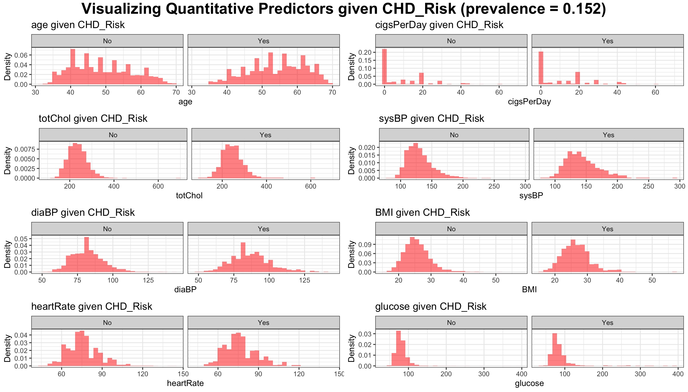

```{r setup, include=FALSE}
knitr::opts_chunk$set(echo = TRUE)
```

```{r libraries, include=FALSE}
source("na-convert.R")
library(tidyverse)
library(ggpubr)
library(xtable)
library(arm)
library(mgcv)
library(rpart)
library(car)
```

# Introduction 

This is a code appendix for our analysis of the Framingham Heart Study using GLMs and GAMS. 

# EDA 

This is the code appendix for our EDA. The goals of this exercise were to discover missingness, visualize the distribution of the response and predictor variables, and assess the predictor variables for obvious signs of multicollinearity. 

## Preprocessing

Read in the data and make note of missing values:

```{r GetData}
data_raw = read.csv("data/chd_risk.csv")
summary(data_raw)
length(data_raw$age)
```

## Check for missingness

Count number of missing predictors in each variable: 

```{r MissingTable}
# Generate the number of missing values for each predictor
apply(is.na(data_raw), 2, sum)
missing_preds = c("education", "cigsPerDay", "totChol", "BMI", 
                  "heartRate", "glucose", "OnBPMeds")
```

## Visualizing the Response 

```{r ResponseBarChart}
# Labels for ticks
N_label = paste("No (", round(mean(data_raw$CHD_Risk == "No"), 2)*100, "%)", sep="")
Y_label = paste("Yes (", round(mean(data_raw$CHD_Risk == "Yes"), 2)*100, "%)", sep="")

# Plot bar chart
p <- ggplot(data=data_raw, aes(x=as.factor(CHD_Risk))) +
  geom_histogram(stat="count",fill="red",
                 aes(y=..count../sum(..count..)),
                 alpha = 0.5) + 
    labs(title="Frequency of CHD_Risk") +
    xlab("CHD_Risk") +
    ylab("Frequency") +
    scale_x_discrete(breaks=c("No","Yes"), labels=c(N_label,Y_label)) +
    theme_bw()
p 
```

## Visualizing the Predictors 

Visualize distribution of quantitative predictors conditional on the CHD outcome: 

```{r QuantPredictors, eval = FALSE}
quant_preds = c("age", "cigsPerDay", "totChol", "sysBP", 
                  "diaBP", "BMI", "heartRate", "glucose")

make_cond_hist = function(varname) {
  p1 = ggplot(data_raw, aes_string(x=varname)) + 
    geom_histogram(aes(y = ..density..), 
                   fill = "red", alpha = 0.5) + 
    labs(title=paste(varname, "given CHD_Risk")) +
    xlab(varname) +
    ylab("Density") + 
    facet_grid(. ~ CHD_Risk) + 
    theme_bw()
  return(p1)
}

graphs = lapply(quant_preds, make_cond_hist)
figure1 = ggarrange(graphs[[1]], graphs[[2]], graphs[[3]], graphs[[4]], 
          graphs[[5]], graphs[[6]], graphs[[7]], graphs[[8]],
          ncol = 2, nrow = 4)
annotate_figure(figure1,
                top = text_grob("Visualizing Quantitative Predictors given CHD_Risk (prevalence = 0.152)", face = "bold", size = 14)
)
```



Visualizing the Qualitative predictors by showing their distributions conditional on the outcome: 

```{r CatPredictors}
# Address Categorical predictors
cat_preds = c("education", "sex", "smoker", "OnBPMeds", 
              "PrevStroke", "Hyp", "Diab")
get_cond_prob_table = function(TABLE) { 
  col1 = TABLE[,1] / sum(TABLE[,1])
  col2 = TABLE[,2] / sum(TABLE[,2])
  return(cbind(No=col1, Yes=col2))
}
tab_education = get_cond_prob_table(table(data_raw$education, data_raw$CHD_Risk))
tab_sex = get_cond_prob_table(table(data_raw$sex, data_raw$CHD_Risk))
tab_smoker = get_cond_prob_table(table(data_raw$smoker, data_raw$CHD_Risk))
tab_OnBPMeds = get_cond_prob_table(table(data_raw$OnBPMeds, data_raw$CHD_Risk))
tab_PrevStroke = get_cond_prob_table(table(data_raw$PrevStroke, data_raw$CHD_Risk))
tab_Hyp = get_cond_prob_table(table(data_raw$Hyp, data_raw$CHD_Risk))
tab_Diab = get_cond_prob_table(table(data_raw$Diab, data_raw$CHD_Risk))

tab_prob_Yes = rbind(tab_education, tab_sex, tab_smoker, 
                     tab_OnBPMeds, tab_PrevStroke, tab_Hyp,
                     tab_Diab)
round(tab_prob_Yes,3)
```

Check for collinearity with GVIF. 

```{r Multicollinearity}
# Check for multicollinearity
mod.vif.lm <- lm(as.numeric(CHD_Risk) ~ ., data=data_raw)
vif(mod.vif.lm)
```

Because all values in the last column are less than 3.1623, there is not significant/strong evidence of multicollinearity.

# Models

This is the code appendix for our modeling section. 

## Begin Building a Model - NaN Values Removed

```{r}
data = read.csv("data/chd_risk.csv")
# force smoker from categorical to numeric
data$smoker = unclass(data$smoker)
data_na = na.omit(data)
nrow(data_na)
nrow(data)
```

Fit a glm with individual predictors, smoker and cigPerDay are multiplied based on first principles. 

```{r}
glm_all = glm(CHD_Risk ~ age + education + totChol + sysBP + diaBP + BMI + heartRate + glucose + sex + smoker:cigsPerDay + OnBPMeds + PrevStroke + Hyp + Diab, family = binomial, data = data_na)
summary(glm_all)
```

Beginning analysis of deviance table. Decided not to do 1-term models with every predictor because that would take forever, so I used the Wald test predictors.

```{r}
glm0 = glm(CHD_Risk ~ 1, family = binomial, data = data_na)
glm1 = glm(CHD_Risk ~ 1 + age, family = binomial, data = data_na)
glm2 = glm(CHD_Risk ~ 1 + sysBP, family = binomial, data = data_na)
glm3 = glm(CHD_Risk ~ 1 + sex, family = binomial, data = data_na)
glm4 = glm(CHD_Risk ~ 1 + smoker:cigsPerDay, family = binomial, data = data_na)

# age is the best
glm5 = glm(CHD_Risk ~ 1 + age + sysBP, family = binomial, data = data_na)
glm6 = glm(CHD_Risk ~ 1 + age + sex, family = binomial, data = data_na)
glm7 = glm(CHD_Risk ~ 1 + age + smoker:cigsPerDay, family = binomial, data = data_na)

# baseline age + sysBP
glm8 = glm(CHD_Risk ~ 1 + age + sysBP + sex, family = binomial, data = data_na)
glm9 = glm(CHD_Risk ~ 1 + age + sysBP + smoker:cigsPerDay, family = binomial, data = data_na)

# baseline age + sysBP + sex
glm10 = glm(CHD_Risk ~ 1 + age + sysBP + sex + smoker:cigsPerDay, family = binomial, data = data_na)

# m working model 
m = glm10

summary(glm10)
# anova(m, glm10, test = "Chisq")
```

Continuing analysis of deviance - checking how each of the other 10 predictors adds to age, sex, sysBP, and smoker:cigsPerDay.

```{r}
m = glm10
glm11 = glm(CHD_Risk ~ 1 + age + sysBP + sex + smoker:cigsPerDay + education, family = binomial, data = data_na)
glm12 = glm(CHD_Risk ~ 1 + age + sysBP + sex + smoker:cigsPerDay + totChol, family = binomial, data = data_na)
glm13 = glm(CHD_Risk ~ 1 + age + sysBP + sex + smoker:cigsPerDay + diaBP, family = binomial, data = data_na)
glm14 = glm(CHD_Risk ~ 1 + age + sysBP + sex + smoker:cigsPerDay + BMI, family = binomial, data = data_na)
glm15 = glm(CHD_Risk ~ 1 + age + sysBP + sex + smoker:cigsPerDay + heartRate, family = binomial, data = data_na)
glm16 = glm(CHD_Risk ~ 1 + age + sysBP + sex + smoker:cigsPerDay + glucose, family = binomial, data = data_na)
glm17 = glm(CHD_Risk ~ 1 + age + sysBP + sex + smoker:cigsPerDay + OnBPMeds, family = binomial, data = data_na)
glm18 = glm(CHD_Risk ~ 1 + age + sysBP + sex + smoker:cigsPerDay + PrevStroke, family = binomial, data = data_na)
glm19 = glm(CHD_Risk ~ 1 + age + sysBP + sex + smoker:cigsPerDay + Hyp, family = binomial, data = data_na)
glm20 = glm(CHD_Risk ~ 1 + age + sysBP + sex + smoker:cigsPerDay + Diab, family = binomial, data = data_na)

# Should use a for loop here to examine deviance of each model
x = summary(glm20)
print(x$call)
print(x$deviance)

anova(glm16, m, test="Chisq")

```

Baseline model: age, sysBP, sex, smoker:cigsPerDay, glucose. 

Now, look for next predictor! Ignore diaBP and heartrate for now. 

```{r}
m = glm16
glm17 = glm(CHD_Risk ~ 1 + age + sysBP + sex + smoker:cigsPerDay + glucose + education, family = binomial, data = data_na)
glm18 = glm(CHD_Risk ~ 1 + age + sysBP + sex + smoker:cigsPerDay + glucose + totChol, family = binomial, data = data_na)
glm19 = glm(CHD_Risk ~ 1 + age + sysBP + sex + smoker:cigsPerDay + glucose + BMI, family = binomial, data = data_na)
glm20 = glm(CHD_Risk ~ 1 + age + sysBP + sex + smoker:cigsPerDay + glucose + OnBPMeds, family = binomial, data = data_na)
glm21 = glm(CHD_Risk ~ 1 + age + sysBP + sex + smoker:cigsPerDay + glucose + PrevStroke, family = binomial, data = data_na)
glm22 = glm(CHD_Risk ~ 1 + age + sysBP + sex + smoker:cigsPerDay + glucose + Hyp, family = binomial, data = data_na)
glm23 = glm(CHD_Risk ~ 1 + age + sysBP + sex + smoker:cigsPerDay + glucose + Diab, family = binomial, data = data_na)

pred6 <- list(glm17, glm18, glm19, glm20, glm21, glm22, glm23)
for (model_i in pred6){
  print(model_i$call)
  print(model_i$deviance)
}
anova(m, glm18, test = "Chisq")

```

Working model is glm18: $age + sysBP + sex + smoker:cigsPerDay + glucose + totChol$. 
Look for 7th predictors. 

```{r}
m = glm18
glm24 = glm(CHD_Risk ~ 1 + age + sysBP + sex + smoker:cigsPerDay + glucose + totChol + education, family = binomial, data = data_na)
glm25 = glm(CHD_Risk ~ 1 + age + sysBP + sex + smoker:cigsPerDay + glucose + totChol + OnBPMeds, family = binomial, data = data_na)
glm26 = glm(CHD_Risk ~ 1 + age + sysBP + sex + smoker:cigsPerDay + glucose + totChol + PrevStroke, family = binomial, data = data_na)
glm27 = glm(CHD_Risk ~ 1 + age + sysBP + sex + smoker:cigsPerDay + glucose + totChol + Hyp, family = binomial, data = data_na)
glm28 = glm(CHD_Risk ~ 1 + age + sysBP + sex + smoker:cigsPerDay + glucose + totChol + diaBP, family = binomial, data = data_na)
glm29 = glm(CHD_Risk ~ 1 + age + sysBP + sex + smoker:cigsPerDay + glucose + totChol + heartRate, family = binomial, data = data_na)


pred7 <- list(glm24, glm25, glm26, glm27, glm28, glm29)
for (model_i in pred7){
  print(model_i$call)
  print(model_i$deviance)
}
anova(m, glm24, test = "Chisq")
```

Interaction terms

```{r}
int1 = glm(CHD_Risk ~ 1 + age + sysBP + sex + smoker:cigsPerDay + glucose + totChol + age:sysBP, family = binomial, data = data_na)
int2 = glm(CHD_Risk ~ 1 + age + sysBP + sex + smoker:cigsPerDay + glucose + totChol + age:sex, family = binomial, data = data_na)
int3 = glm(CHD_Risk ~ 1 + age + sysBP + sex + smoker:cigsPerDay + glucose + totChol + age:smoker:cigsPerDay, family = binomial, data = data_na)
int4 = glm(CHD_Risk ~ 1 + age + sysBP + sex + smoker:cigsPerDay + glucose + totChol + age:glucose, family = binomial, data = data_na)
int5 = glm(CHD_Risk ~ 1 + age + sysBP + sex + smoker:cigsPerDay + glucose + totChol + age:totChol, family = binomial, data = data_na)
int6 = glm(CHD_Risk ~ 1 + age + sysBP + sex + smoker:cigsPerDay + glucose + totChol + sysBP:sex, family = binomial, data = data_na)
int7 = glm(CHD_Risk ~ 1 + age + sysBP + sex + smoker:cigsPerDay + glucose + totChol + sysBP:smoker:cigsPerDay, family = binomial, data = data_na)
int8 = glm(CHD_Risk ~ 1 + age + sysBP + sex + smoker:cigsPerDay + glucose + totChol + sysBP:glucose, family = binomial, data = data_na)
int9 = glm(CHD_Risk ~ 1 + age + sysBP + sex + smoker:cigsPerDay + glucose + totChol + sysBP:totChol, family = binomial, data = data_na)
int10 = glm(CHD_Risk ~ 1 + age + sysBP + sex + smoker:cigsPerDay + glucose + totChol + sex:smoker:cigsPerDay, family = binomial, data = data_na)
int11 = glm(CHD_Risk ~ 1 + age + sysBP + sex + smoker:cigsPerDay + glucose + totChol + sex:glucose, family = binomial, data = data_na)
int12 = glm(CHD_Risk ~ 1 + age + sysBP + sex + smoker:cigsPerDay + glucose + totChol + sex:totChol, family = binomial, data = data_na)
int13 = glm(CHD_Risk ~ 1 + age + sysBP + sex + smoker:cigsPerDay + glucose + totChol + smoker:cigsPerDay:glucose, family = binomial, data = data_na)
int14 = glm(CHD_Risk ~ 1 + age + sysBP + sex + smoker:cigsPerDay + glucose + totChol + smoker:cigsPerDay:totChol, family = binomial, data = data_na)
int15 = glm(CHD_Risk ~ 1 + age + sysBP + sex + smoker:cigsPerDay + glucose + totChol + glucose:totChol, family = binomial, data = data_na)

inter1 <- list(int1, int2, int3, int4, int5, int6, int7, int8, int9, int10, int11, int12, int13, int14, int15)
for (model_i in inter1){
  print(model_i$call)
  print(model_i$deviance)
}
anova(m, int15, test = "Chisq")
```

## Final GLM 

```{r finalGLM}
final.glm = glm(CHD_Risk ~ 1 + age + sysBP + sex + smoker:cigsPerDay + glucose + totChol, family = binomial, data = data_na)
```

## Model Fit

Examine model fit

```{r}
summary(m)

3120.5 / 3655 # residual deviance / df

# hosmer-lemeshow function (source: lowbwt-03.R)
hosmerlem = function (y, yhat, g = 10) {
  cutyhat = cut(yhat, breaks = quantile(yhat, probs = seq(0, 1, 1/g)), 
                include.lowest = T)
  obs = xtabs(cbind(1 - y, y) ~ cutyhat)
  expect = xtabs(cbind(1 - yhat, yhat) ~ cutyhat)
  chisq = sum((obs - expect)^2 / expect)
  P = 1 - pchisq(chisq, g - 2)
  c("X^2" = chisq, Df = g - 2, "P(>Chi)" = P)
}

# try different values of g to see if results are sensitive to choice
hosmerlem(m$y, fitted(m)) # g = 10
hosmerlem(m$y, fitted(m), g = 5) # g = 5
hosmerlem(m$y, fitted(m), g = 15) # g = 15
```

## Diagnostics 

```{r}
# plot averaged residuals vs. fitted probabilities
binnedplot(fitted(m), residuals(m, type = "response"),
  xlab = "Averaged Fitted Probabilities",
  ylab = "Averaged Residuals",
  pch = 19, col.pts = "red", cex.pts = 1.5,
  main = "Averaged Residuals vs. Fitted Plot for Final Model")
abline(h = 0, lty = 2, col = "green")
```

```{r}
# plot cook's distances
plot(cooks.distance(m), type = "h", lwd = 2,
  xlab = "Observation Index",
  ylab = "Cook's Distances",
  main = "Cook's Distances for Final Model")
abline(h = 1, lty = 2, col = "red")
```

## Begin Building a Model - na.convert.mean

Reprocess data: 

```{r}
# Begin building model
data = read.csv("data/chd_risk.csv")
# force smoker from categorical to numeric
data$smoker = unclass(data$smoker)
data_na = na.convert.mean(data)
```

GLM with individual predictors, smoker and cigPerDay are combined based on first principles. 

```{r}
glm_all = glm(CHD_Risk ~ age + education + totChol + sysBP + diaBP + BMI + heartRate + glucose + sex + smoker:cigsPerDay + OnBPMeds + PrevStroke + Hyp + Diab + cigsPerDay.na + totChol.na + BMI.na + heartRate.na + glucose.na, family = binomial, data = data_na)
summary(glm_all)
```

Beginning analysis of deviance table. We decided not to do 1-term models with every predictor because that would take forever, so we used the Wald test predictors.

```{r}
glm0 = glm(CHD_Risk ~ 1, family = binomial, data = data_na)
glm1 = glm(CHD_Risk ~ 1 + age, family = binomial, data = data_na)
glm2 = glm(CHD_Risk ~ 1 + sysBP, family = binomial, data = data_na)
glm3 = glm(CHD_Risk ~ 1 + sex, family = binomial, data = data_na)
glm4 = glm(CHD_Risk ~ 1 + smoker:cigsPerDay, family = binomial, data = data_na)
glm4b = glm(CHD_Risk ~ 1 + BMI.na, family = binomial, data = data_na)

pred1 <- list(glm0, glm1, glm2, glm3, glm4, glm4b)
for (model_i in pred1){
  print(summary(model_i)$call)
  print(summary(model_i)$deviance)
}

m = glm0
anova(m, glm1, test="Chisq")

```

Age is the best predictor. Continue Analysis of deviance: 

```{r}
m = glm1

glm5 = glm(CHD_Risk ~ 1 + age + sysBP, family = binomial, data = data_na)
glm6 = glm(CHD_Risk ~ 1 + age + sex, family = binomial, data = data_na)
glm7 = glm(CHD_Risk ~ 1 + age + smoker:cigsPerDay, family = binomial, data = data_na)
glm7b = glm(CHD_Risk ~ 1 + age + BMI.na, family = binomial, data = data_na)
pred2 <- list(glm5, glm6, glm7, glm7b)
for (model_i in pred2){
  print(summary(model_i)$call)
  print(summary(model_i)$deviance)
}
anova(m, glm5, test="Chisq")
```

sysBP is the best predictor. Continue Analysis of deviance: 

```{r}
m = glm5
# baseline age + sysBP
glm8 = glm(CHD_Risk ~ 1 + age + sysBP + sex, family = binomial, data = data_na)
glm9 = glm(CHD_Risk ~ 1 + age + sysBP + smoker:cigsPerDay, family = binomial, data = data_na)
glm9b = glm(CHD_Risk ~ 1 + age + sysBP + BMI.na, family = binomial, data = data_na)
pred3 <- list(glm8, glm9, glm9b)
for (model_i in pred3){
  print(summary(model_i)$call)
  print(summary(model_i)$deviance)
}
anova(m, glm9, test="Chisq")
```

smoker:cigsPerDay is the best predictor. Continue Analysis of deviance: 

```{r}
m = glm9
# baseline age + sysBP + smoker:cigsPerDay
glm10 = glm(CHD_Risk ~ 1 + age + sysBP + smoker:cigsPerDay + sex, family = binomial, data = data_na)
glm10b = glm(CHD_Risk ~ 1 + age + sysBP + smoker:cigsPerDay + BMI.na, family = binomial, data = data_na)

for (i in list(glm10, glm10b)){
  print(summary(i)$call)
  print(summary(i)$deviance)
}
```

Continuing analysis of deviance - checking how each of the other 10 predictors adds to age, sex, sysBP, and smoker:cigsPerDay:

```{r, eval=FALSE}
m = glm10
glm11 = glm(CHD_Risk ~ 1 + age + sysBP + sex + smoker:cigsPerDay + education, family = binomial, data = data_na)
glm12 = glm(CHD_Risk ~ 1 + age + sysBP + sex + smoker:cigsPerDay + totChol, family = binomial, data = data_na)
glm13 = glm(CHD_Risk ~ 1 + age + sysBP + sex + smoker:cigsPerDay + diaBP, family = binomial, data = data_na)
glm14 = glm(CHD_Risk ~ 1 + age + sysBP + sex + smoker:cigsPerDay + BMI, family = binomial, data = data_na)
glm15 = glm(CHD_Risk ~ 1 + age + sysBP + sex + smoker:cigsPerDay + heartRate, family = binomial, data = data_na)
glm16 = glm(CHD_Risk ~ 1 + age + sysBP + sex + smoker:cigsPerDay + glucose, family = binomial, data = data_na)
glm17 = glm(CHD_Risk ~ 1 + age + sysBP + sex + smoker:cigsPerDay + OnBPMeds, family = binomial, data = data_na)
glm18 = glm(CHD_Risk ~ 1 + age + sysBP + sex + smoker:cigsPerDay + PrevStroke, family = binomial, data = data_na)
glm19 = glm(CHD_Risk ~ 1 + age + sysBP + sex + smoker:cigsPerDay + Hyp, family = binomial, data = data_na)
glm20 = glm(CHD_Risk ~ 1 + age + sysBP + sex + smoker:cigsPerDay + Diab, family = binomial, data = data_na)
glm20b = glm(CHD_Risk ~ 1 + age + sysBP + sex + smoker:cigsPerDay + BMI.na, family = binomial, data = data_na)

pred5 <- list(glm11, glm12, glm13, glm14, glm15, glm16, glm17, glm18, glm19, glm20, glm20b)

for (model_i in pred5){
  print(summary(model_i)$call)
  print(summary(model_i)$deviance)
}

anova(glm16, m, test="Chisq")
```

Baseline model: age, sysBP, sex, smoker:cigsPerDay, glucose.

Look for next predictor! Ignore diaBP and heartrate for now.

```{r, eval=FALSE}
m = glm16
glm17 = glm(CHD_Risk ~ 1 + age + sysBP + sex + smoker:cigsPerDay + glucose + education, family = binomial, data = data_na)
glm18 = glm(CHD_Risk ~ 1 + age + sysBP + sex + smoker:cigsPerDay + glucose + totChol, family = binomial, data = data_na)
glm19 = glm(CHD_Risk ~ 1 + age + sysBP + sex + smoker:cigsPerDay + glucose + BMI, family = binomial, data = data_na)
glm20 = glm(CHD_Risk ~ 1 + age + sysBP + sex + smoker:cigsPerDay + glucose + OnBPMeds, family = binomial, data = data_na)
glm21 = glm(CHD_Risk ~ 1 + age + sysBP + sex + smoker:cigsPerDay + glucose + PrevStroke, family = binomial, data = data_na)
glm22 = glm(CHD_Risk ~ 1 + age + sysBP + sex + smoker:cigsPerDay + glucose + Hyp, family = binomial, data = data_na)
glm23 = glm(CHD_Risk ~ 1 + age + sysBP + sex + smoker:cigsPerDay + glucose + Diab, family = binomial, data = data_na)
glm23b = glm(CHD_Risk ~ 1 + age + sysBP + sex + smoker:cigsPerDay + glucose + BMI.na, family = binomial, data = data_na)

pred6 <- list(glm17, glm18, glm19, glm20, glm21, glm22, glm23, glm23b)
for (model_i in pred6){
  print(model_i$call)
  print(model_i$deviance)
}
anova(m, glm23b, test = "Chisq")

```

Working model is glm23b: $age + sysBP + sex + smoker:cigsPerDay + glucose + BMI.na$

Look for 7th predictors:

```{r, eval=FALSE}
m = glm23b
glm24 = glm(CHD_Risk ~ 1 + age + sysBP + sex + smoker:cigsPerDay + glucose + BMI.na + education, family = binomial, data = data_na)
glm25 = glm(CHD_Risk ~ 1 + age + sysBP + sex + smoker:cigsPerDay + glucose + BMI.na + OnBPMeds, family = binomial, data = data_na)
glm26 = glm(CHD_Risk ~ 1 + age + sysBP + sex + smoker:cigsPerDay + glucose + BMI.na + PrevStroke, family = binomial, data = data_na)
glm27 = glm(CHD_Risk ~ 1 + age + sysBP + sex + smoker:cigsPerDay + glucose + BMI.na + Hyp, family = binomial, data = data_na)
glm28 = glm(CHD_Risk ~ 1 + age + sysBP + sex + smoker:cigsPerDay + glucose + BMI.na + diaBP, family = binomial, data = data_na)
glm29 = glm(CHD_Risk ~ 1 + age + sysBP + sex + smoker:cigsPerDay + glucose + BMI.na + heartRate, family = binomial, data = data_na)
glm30 = glm(CHD_Risk ~ 1 + age + sysBP + sex + smoker:cigsPerDay + glucose + BMI.na + totChol, family = binomial, data = data_na)


pred7 <- list(glm24, glm25, glm26, glm27, glm28, glm29, glm30)
for (model_i in pred7){
  print(model_i$call)
  print(model_i$deviance)
}
anova(m, glm26, test = "Chisq")
```

Working model is glm26: $age + sysBP + sex + smoker:cigsPerDay + glucose + BMI.na + PrevStroke$

Look for 8th predictors:

```{r, eval=FALSE}
m = glm26
glm31 = glm(CHD_Risk ~ 1 + age + sysBP + sex + smoker:cigsPerDay + glucose + BMI.na + PrevStroke + education, family = binomial, data = data_na)
glm32 = glm(CHD_Risk ~ 1 + age + sysBP + sex + smoker:cigsPerDay + glucose + BMI.na + PrevStroke + OnBPMeds, family = binomial, data = data_na)
glm33 = glm(CHD_Risk ~ 1 + age + sysBP + sex + smoker:cigsPerDay + glucose + BMI.na + PrevStroke + Hyp, family = binomial, data = data_na)
glm34 = glm(CHD_Risk ~ 1 + age + sysBP + sex + smoker:cigsPerDay + glucose + BMI.na + Diab, family = binomial, data = data_na)
glm35 = glm(CHD_Risk ~ 1 + age + sysBP + sex + smoker:cigsPerDay + glucose + BMI.na + BMI.na, family = binomial, data = data_na)
glm36 = glm(CHD_Risk ~ 1 + age + sysBP + sex + smoker:cigsPerDay + glucose + BMI.na + totChol, family = binomial, data = data_na)

pred8 <- list(glm31, glm32, glm33, glm34, glm35, glm36)
for (model_i in pred8){
  print(model_i$call)
  print(model_i$deviance)
}
anova(m, glm31, test="Chisq")
```

Working model is glm26: $age + sysBP + sex + smoker:cigsPerDay + glucose + BMI.na + PrevStroke$

Look for two-way Interaction Terms:

```{r, eval=FALSE}
# Interaction terms
int1 = glm(CHD_Risk ~ 1 + age + sysBP + sex + smoker:cigsPerDay + glucose + BMI.na + PrevStroke + age:sysBP, family = binomial, data = data_na)
int2 = glm(CHD_Risk ~ 1 + age + sysBP + sex + smoker:cigsPerDay + glucose + BMI.na + PrevStroke + age:sex, family = binomial, data = data_na)
int3 = glm(CHD_Risk ~ 1 + age + sysBP + sex + smoker:cigsPerDay + glucose + BMI.na + PrevStroke + age:smoker:cigsPerDay, family = binomial, data = data_na)
int4 = glm(CHD_Risk ~ 1 + age + sysBP + sex + smoker:cigsPerDay + glucose + BMI.na + PrevStroke + age:glucose, family = binomial, data = data_na)
int5 = glm(CHD_Risk ~ 1 + age + sysBP + sex + smoker:cigsPerDay + glucose + BMI.na + PrevStroke + age:BMI.na, family = binomial, data = data_na)
int6 = glm(CHD_Risk ~ 1 + age + sysBP + sex + smoker:cigsPerDay + glucose + BMI.na + PrevStroke + age:PrevStroke, family = binomial, data = data_na)
int7 = glm(CHD_Risk ~ 1 + age + sysBP + sex + smoker:cigsPerDay + glucose + BMI.na + PrevStroke + sysBP:sex, family = binomial, data = data_na)
int8 = glm(CHD_Risk ~ 1 + age + sysBP + sex + smoker:cigsPerDay + glucose + BMI.na + PrevStroke + sysBP:smoker:cigsPerDay, family = binomial, data = data_na)
int9 = glm(CHD_Risk ~ 1 + age + sysBP + sex + smoker:cigsPerDay + glucose + BMI.na + PrevStroke + sysBP:glucose, family = binomial, data = data_na)
int10 = glm(CHD_Risk ~ 1 + age + sysBP + sex + smoker:cigsPerDay + glucose + BMI.na + PrevStroke + sysBP:BMI.na, family = binomial, data = data_na)
int11 = glm(CHD_Risk ~ 1 + age + sysBP + sex + smoker:cigsPerDay + glucose + BMI.na + PrevStroke + sysBP:PrevStroke, family = binomial, data = data_na)
int12 = glm(CHD_Risk ~ 1 + age + sysBP + sex + smoker:cigsPerDay + glucose + BMI.na + PrevStroke + sex:smoker:cigsPerDay, family = binomial, data = data_na)
int13 = glm(CHD_Risk ~ 1 + age + sysBP + sex + smoker:cigsPerDay + glucose + BMI.na + PrevStroke + sex:glucose, family = binomial, data = data_na)
int14 = glm(CHD_Risk ~ 1 + age + sysBP + sex + smoker:cigsPerDay + glucose + BMI.na + PrevStroke + sex:BMI.na, family = binomial, data = data_na)
int15 = glm(CHD_Risk ~ 1 + age + sysBP + sex + smoker:cigsPerDay + glucose + BMI.na + PrevStroke + sex:PrevStroke, family = binomial, data = data_na)
int16 = glm(CHD_Risk ~ 1 + age + sysBP + sex + smoker:cigsPerDay + glucose + BMI.na + PrevStroke + smoker:cigsPerDay:glucose, family = binomial, data = data_na)
int17 = glm(CHD_Risk ~ 1 + age + sysBP + sex + smoker:cigsPerDay + glucose + BMI.na + PrevStroke + smoker:cigsPerDay:BMI.na, family = binomial, data = data_na)
int18 = glm(CHD_Risk ~ 1 + age + sysBP + sex + smoker:cigsPerDay + glucose + BMI.na + PrevStroke + smoker:cigsPerDay:PrevStroke, family = binomial, data = data_na)
int19 = glm(CHD_Risk ~ 1 + age + sysBP + sex + smoker:cigsPerDay + glucose + BMI.na + PrevStroke + glucose:BMI.na, family = binomial, data = data_na)
int20 = glm(CHD_Risk ~ 1 + age + sysBP + sex + smoker:cigsPerDay + glucose + BMI.na + PrevStroke + glucose:PrevStroke, family = binomial, data = data_na)
int21 = glm(CHD_Risk ~ 1 + age + sysBP + sex + smoker:cigsPerDay + glucose + BMI.na + PrevStroke + BMI.na:PrevStroke, family = binomial, data = data_na)


inter1 <- list(int1, int2, int3, int4, int5, int6, int7, int8, int9, int10, int11, int12, int13, int14, int15, int16, int17, int18, int19, int20, int21)
for (model_i in inter1){
  print(model_i$call)
  print(model_i$deviance)
}
anova(m, int7, test = "Chisq")
```

Working model is int7: $age + sysBP + sex + smoker:cigsPerDay + glucose + BMI.na + PrevStroke + sysBP:sex$.

Look for two-way Interaction Terms:

```{r, eval=FALSE}
m = int7
# Interaction terms
int22 = glm(CHD_Risk ~ 1 + age + sysBP + sex + smoker:cigsPerDay + glucose + BMI.na + PrevStroke + BMI.na:PrevStroke + sex:sysBP, family = binomial, data = data_na)
int23 = glm(CHD_Risk ~ 1 + age + sysBP + sex + smoker:cigsPerDay + glucose + BMI.na + PrevStroke + age:sex + sex:sysBP, family = binomial, data = data_na)
int24 = glm(CHD_Risk ~ 1 + age + sysBP + sex + smoker:cigsPerDay + glucose + BMI.na + PrevStroke + age:smoker:cigsPerDay + sex:sysBP, family = binomial, data = data_na)
int25 = glm(CHD_Risk ~ 1 + age + sysBP + sex + smoker:cigsPerDay + glucose + BMI.na + PrevStroke + age:glucose + sex:sysBP, family = binomial, data = data_na)
int26 = glm(CHD_Risk ~ 1 + age + sysBP + sex + smoker:cigsPerDay + glucose + BMI.na + PrevStroke + age:BMI.na + sex:sysBP, family = binomial, data = data_na)
int27 = glm(CHD_Risk ~ 1 + age + sysBP + sex + smoker:cigsPerDay + glucose + BMI.na + PrevStroke + age:PrevStroke + sex:sysBP, family = binomial, data = data_na)
int28 = glm(CHD_Risk ~ 1 + age + sysBP + sex + smoker:cigsPerDay + glucose + BMI.na + PrevStroke + sysBP:sex + sex:sysBP, family = binomial, data = data_na)
int29 = glm(CHD_Risk ~ 1 + age + sysBP + sex + smoker:cigsPerDay + glucose + BMI.na + PrevStroke + sysBP:smoker:cigsPerDay + sex:sysBP, family = binomial, data = data_na)
int30 = glm(CHD_Risk ~ 1 + age + sysBP + sex + smoker:cigsPerDay + glucose + BMI.na + PrevStroke + sysBP:glucose + sex:sysBP, family = binomial, data = data_na)
int31 = glm(CHD_Risk ~ 1 + age + sysBP + sex + smoker:cigsPerDay + glucose + BMI.na + PrevStroke + sysBP:BMI.na + sex:sysBP, family = binomial, data = data_na)
int32 = glm(CHD_Risk ~ 1 + age + sysBP + sex + smoker:cigsPerDay + glucose + BMI.na + PrevStroke + sysBP:PrevStroke + sex:sysBP, family = binomial, data = data_na)
int33 = glm(CHD_Risk ~ 1 + age + sysBP + sex + smoker:cigsPerDay + glucose + BMI.na + PrevStroke + sex:smoker:cigsPerDay + sex:sysBP, family = binomial, data = data_na)
int34 = glm(CHD_Risk ~ 1 + age + sysBP + sex + smoker:cigsPerDay + glucose + BMI.na + PrevStroke + sex:glucose + sex:sysBP, family = binomial, data = data_na)
int35 = glm(CHD_Risk ~ 1 + age + sysBP + sex + smoker:cigsPerDay + glucose + BMI.na + PrevStroke + sex:BMI.na + sex:sysBP, family = binomial, data = data_na)
int36 = glm(CHD_Risk ~ 1 + age + sysBP + sex + smoker:cigsPerDay + glucose + BMI.na + PrevStroke + sex:PrevStroke + sex:sysBP, family = binomial, data = data_na)
int37 = glm(CHD_Risk ~ 1 + age + sysBP + sex + smoker:cigsPerDay + glucose + BMI.na + PrevStroke + smoker:cigsPerDay:glucose + sex:sysBP, family = binomial, data = data_na)
int38 = glm(CHD_Risk ~ 1 + age + sysBP + sex + smoker:cigsPerDay + glucose + BMI.na + PrevStroke + smoker:cigsPerDay:BMI.na + sex:sysBP, family = binomial, data = data_na)
int39 = glm(CHD_Risk ~ 1 + age + sysBP + sex + smoker:cigsPerDay + glucose + BMI.na + PrevStroke + smoker:cigsPerDay:PrevStroke + sex:sysBP, family = binomial, data = data_na)
int40 = glm(CHD_Risk ~ 1 + age + sysBP + sex + smoker:cigsPerDay + glucose + BMI.na + PrevStroke + glucose:BMI.na + sex:sysBP, family = binomial, data = data_na)
int41 = glm(CHD_Risk ~ 1 + age + sysBP + sex + smoker:cigsPerDay + glucose + BMI.na + PrevStroke + glucose:PrevStroke + sex:sysBP, family = binomial, data = data_na)


inter1 <- list(m, int22, int23, int24, int25, int26, int27, int28, int29, int30, int31, int32, int33, int34, int35, int36, int37, int38, int39, int40, int41)
for (model_i in inter1){
  print(model_i$call)
  print(model_i$deviance)
}
anova(m, int35, test = "Chisq")
```

End Analysis of Deviance test. 

# Model Diagnostics

Examine model fit.

```{r, include=F}
 m = glm(CHD_Risk ~ 1 + age + sysBP + sex + smoker:cigsPerDay + glucose + BMI.na + PrevStroke + sysBP:sex, family = binomial, data = data_na)
```

```{r}
summary(m)

3120.5 / 3655 # residual deviance / df

# hosmer-lemeshow function (source: lowbwt-03.R)
hosmerlem = function (y, yhat, g = 10) {
  cutyhat = cut(yhat, breaks = quantile(yhat, probs = seq(0, 1, 1/g)), 
                include.lowest = T)
  obs = xtabs(cbind(1 - y, y) ~ cutyhat)
  expect = xtabs(cbind(1 - yhat, yhat) ~ cutyhat)
  chisq = sum((obs - expect)^2 / expect)
  P = 1 - pchisq(chisq, g - 2)
  c("X^2" = chisq, Df = g - 2, "P(>Chi)" = P)
}

# try different values of g to see if results are sensitive to choice
hosmerlem(m$y, fitted(m)) # g = 10
hosmerlem(m$y, fitted(m), g = 5) # g = 5
hosmerlem(m$y, fitted(m), g = 15) # g = 15
```

## Plots 

Plot averaged residuals vs. fitted probabilities: 

```{r}
binnedplot(fitted(m), residuals(m, type = "response"),
  xlab = "Averaged Fitted Probabilities",
  ylab = "Averaged Residuals",
  pch = 19, col.pts = "red", cex.pts = 1.5,
  main = "Averaged Residuals vs. Fitted Plot for Final Model")
abline(h = 0, lty = 2, col = "green")
```

Plot Cook's distances:

```{r}
plot(cooks.distance(m), type = "h", lwd = 2,
  xlab = "Observation Index",
  ylab = "Cook's Distances",
  main = "Cook's Distances for Final Model")
abline(h = 1, lty = 2, col = "red")
```

# GAM Begins

Initialize a GAM with all of our models. 

```{r, eval=F}
gam.init <- gam(CHD_Risk~s(age)+education+s(cigsPerDay, smoker)+s(totChol)+s(sysBP)+s(diaBP)+s(BMI)+s(heartRate)+s(glucose)+sex+OnBPMeds+PrevStroke+Hyp+Diab, family = binomial, data = data_na)
gam.age1 <- gam(CHD_Risk~education+s(cigsPerDay, smoker)+s(totChol)+s(sysBP)+s(diaBP)+s(BMI)+s(heartRate)+s(glucose)+sex+OnBPMeds+PrevStroke+Hyp+Diab, family = binomial, data = data_na)
gam.education1 <- gam(CHD_Risk~s(age)+s(cigsPerDay,smoker)+s(totChol)+s(sysBP)+s(diaBP)+s(BMI)+s(heartRate)+s(glucose)+sex+OnBPMeds+PrevStroke+Hyp+Diab, family = binomial, data = data_na)
gam.totChol1 <- gam(CHD_Risk~s(age)+education+s(cigsPerDay, smoker)+s(sysBP)+s(diaBP)+s(BMI)+s(heartRate)+s(glucose)+sex+OnBPMeds+PrevStroke+Hyp+Diab, family = binomial, data = data_na)
gam.sysBP1 <- gam(CHD_Risk~s(age)+education+s(cigsPerDay,smoker)+s(totChol)+s(diaBP)+s(BMI)+s(heartRate)+s(glucose)+sex+OnBPMeds+PrevStroke+Hyp+Diab, family = binomial, data = data_na)
gam.diaBP1 <- gam(CHD_Risk~s(age)+education+s(cigsPerDay,smoker)+s(totChol)+s(sysBP)+s(BMI)+s(heartRate)+s(glucose)+sex+OnBPMeds+PrevStroke+Hyp+Diab, family = binomial, data = data_na)
gam.BMI1 <- gam(CHD_Risk~s(age)+education+s(cigsPerDay, smoker)+s(totChol)+s(sysBP)+s(diaBP)+s(heartRate)+s(glucose)+sex+OnBPMeds+PrevStroke+Hyp+Diab, family = binomial, data = data_na)
gam.heartRate1 <- gam(CHD_Risk~s(age)+education+s(cigsPerDay, smoker)+s(totChol)+s(sysBP)+s(diaBP)+s(BMI)+s(glucose)+sex+OnBPMeds+PrevStroke+Hyp+Diab, family = binomial, data = data_na)
gam.glucose1 <- gam(CHD_Risk~s(age)+education+s(cigsPerDay, smoker)+s(totChol)+s(sysBP)+s(diaBP)+s(BMI)+s(heartRate)+sex+OnBPMeds+PrevStroke+Hyp+Diab, family = binomial, data = data_na)
gam.sex1 <- gam(CHD_Risk~s(age)+education+s(cigsPerDay, smoker)+s(totChol)+s(sysBP)+s(diaBP)+s(BMI)+s(heartRate)+s(glucose)+OnBPMeds+PrevStroke+Hyp+Diab, family = binomial, data = data_na)
gam.smoker1 <- gam(CHD_Risk~s(age)+education+s(totChol)+s(sysBP)+s(diaBP)+s(BMI)+s(heartRate)+s(glucose)+sex+OnBPMeds+PrevStroke+Hyp+Diab, family = binomial, data = data_na)
gam.OnBPMeds1 <- gam(CHD_Risk~s(age)+education+s(cigsPerDay, smoker)+s(totChol)+s(sysBP)+s(diaBP)+s(BMI)+s(heartRate)+s(glucose)+sex+PrevStroke+Hyp+Diab, family = binomial, data = data_na)
gam.PrevStroke1 <- gam(CHD_Risk~s(age)+education+s(cigsPerDay, smoker)+s(totChol)+s(sysBP)+s(diaBP)+s(BMI)+s(heartRate)+s(glucose)+sex+OnBPMeds+Hyp+Diab, family = binomial, data = data_na)
gam.Hyp1 <- gam(CHD_Risk~s(age)+education+s(cigsPerDay, smoker)+s(totChol)+s(sysBP)+s(diaBP)+s(BMI)+s(heartRate)+s(glucose)+sex+OnBPMeds+PrevStroke+Diab, family = binomial, data = data_na)
gam.Diab1 <- gam(CHD_Risk~s(age)+education+s(cigsPerDay, smoker)+s(totChol)+s(sysBP)+s(diaBP)+s(BMI)+s(heartRate)+s(glucose)+sex+OnBPMeds+PrevStroke+Hyp, family = binomial, data = data_na)
```

Check for significance. 

```{r, eval=F}
anova(gam.age1, gam.init, test = "Chisq")
anova(gam.education1, gam.init, test = "Chisq")
anova(gam.totChol1, gam.init, test = "Chisq")
anova(gam.sysBP1, gam.init, test = "Chisq")
anova(gam.diaBP1, gam.init, test = "Chisq")
anova(gam.BMI1, gam.init, test = "Chisq")
anova(gam.heartRate1, gam.init, test = "Chisq")
anova(gam.glucose1, gam.init, test = "Chisq")
anova(gam.sex1, gam.init, test = "Chisq")
anova(gam.smoker1, gam.init, test = "Chisq")
anova(gam.OnBPMeds1, gam.init, test = "Chisq")
anova(gam.PrevStroke1, gam.init, test = "Chisq")
anova(gam.Hyp1, gam.init, test = "Chisq")
anova(gam.Diab1, gam.init, test = "Chisq")
```

First, remove Diab. 

```{r , eval=F}
gam.init2 <- gam(CHD_Risk~s(age)+education+s(cigsPerDay, smoker)+s(totChol)+s(sysBP)+s(diaBP)+s(BMI)+s(heartRate)+s(glucose)+sex+OnBPMeds+PrevStroke+Hyp, family = binomial, data = data_na)
gam.age2 <- gam(CHD_Risk~education+s(cigsPerDay, smoker)+s(totChol)+s(sysBP)+s(diaBP)+s(BMI)+s(heartRate)+s(glucose)+sex+OnBPMeds+PrevStroke+Hyp, family = binomial, data = data_na)
gam.education2 <- gam(CHD_Risk~s(age)+s(cigsPerDay, smoker)+s(totChol)+s(sysBP)+s(diaBP)+s(BMI)+s(heartRate)+s(glucose)+sex+OnBPMeds+PrevStroke+Hyp, family = binomial, data = data_na)
gam.totChol2 <- gam(CHD_Risk~s(age)+education+s(cigsPerDay, smoker)+s(sysBP)+s(diaBP)+s(BMI)+s(heartRate)+s(glucose)+sex+OnBPMeds+PrevStroke+Hyp, family = binomial, data = data_na)
gam.sysBP2 <- gam(CHD_Risk~s(age)+education+s(cigsPerDay, smoker)+s(totChol)+s(diaBP)+s(BMI)+s(heartRate)+s(glucose)+sex+OnBPMeds+PrevStroke+Hyp, family = binomial, data = data_na)
gam.diaBP2 <- gam(CHD_Risk~s(age)+education+s(cigsPerDay, smoker)+s(totChol)+s(sysBP)+s(BMI)+s(heartRate)+s(glucose)+sex+OnBPMeds+PrevStroke+Hyp, family = binomial, data = data_na)
gam.BMI2 <- gam(CHD_Risk~s(age)+education+s(cigsPerDay, smoker)+s(totChol)+s(sysBP)+s(diaBP)+s(heartRate)+s(glucose)+sex+OnBPMeds+PrevStroke+Hyp, family = binomial, data = data_na)
gam.heartRate2 <- gam(CHD_Risk~s(age)+education+s(cigsPerDay, smoker)+s(totChol)+s(sysBP)+s(diaBP)+s(BMI)+s(glucose)+sex+OnBPMeds+PrevStroke+Hyp, family = binomial, data = data_na)
gam.glucose2 <- gam(CHD_Risk~s(age)+education+s(cigsPerDay, smoker)+s(totChol)+s(sysBP)+s(diaBP)+s(BMI)+s(heartRate)+sex+OnBPMeds+PrevStroke+Hyp, family = binomial, data = data_na)
gam.sex2 <- gam(CHD_Risk~s(age)+education+s(cigsPerDay, smoker)+s(totChol)+s(sysBP)+s(diaBP)+s(BMI)+s(heartRate)+s(glucose)+OnBPMeds+PrevStroke+Hyp, family = binomial, data = data_na)
gam.smoker2 <- gam(CHD_Risk~s(age)+education+s(totChol)+s(sysBP)+s(diaBP)+s(BMI)+s(heartRate)+s(glucose)+sex+OnBPMeds+PrevStroke+Hyp, family = binomial, data = data_na)
gam.OnBPMeds2 <- gam(CHD_Risk~s(age)+education+s(cigsPerDay, smoker)+s(totChol)+s(sysBP)+s(diaBP)+s(BMI)+s(heartRate)+s(glucose)+sex+PrevStroke+Hyp, family = binomial, data = data_na)
gam.PrevStroke2 <- gam(CHD_Risk~s(age)+education+s(cigsPerDay, smoker)+s(totChol)+s(sysBP)+s(diaBP)+s(BMI)+s(heartRate)+s(glucose)+sex+OnBPMeds+Hyp, family = binomial, data = data_na)
gam.Hyp2 <- gam(CHD_Risk~s(age)+education+s(cigsPerDay, smoker)+s(totChol)+s(sysBP)+s(diaBP)+s(BMI)+s(heartRate)+s(glucose)+sex+OnBPMeds+PrevStroke, family = binomial, data = data_na)
```

Check for significance. 

```{r, eval=F}
anova(gam.age2, gam.init2, test = "Chisq")
anova(gam.education2, gam.init2, test = "Chisq")
anova(gam.totChol2, gam.init2, test = "Chisq")
anova(gam.sysBP2, gam.init2, test = "Chisq")
anova(gam.diaBP2, gam.init2, test = "Chisq")
anova(gam.BMI2, gam.init2, test = "Chisq")
anova(gam.heartRate2, gam.init2, test = "Chisq")
anova(gam.glucose2, gam.init2, test = "Chisq")
anova(gam.sex2, gam.init2, test = "Chisq")
anova(gam.smoker2, gam.init2, test = "Chisq")
anova(gam.OnBPMeds2, gam.init2, test = "Chisq")
anova(gam.PrevStroke2, gam.init2, test = "Chisq")
anova(gam.Hyp2, gam.init2, test = "Chisq")
```

Remove OnBPMeds.

```{r, eval=F}
gam.init3 <- gam(CHD_Risk~s(age)+education+s(cigsPerDay, smoker)+s(totChol)+s(sysBP)+s(diaBP)+s(BMI)+s(heartRate)+s(glucose)+sex+PrevStroke+Hyp, family = binomial, data = data_na)
gam.age3 <- gam(CHD_Risk~education+s(cigsPerDay, smoker)+s(totChol)+s(sysBP)+s(diaBP)+s(BMI)+s(heartRate)+s(glucose)+sex+PrevStroke+Hyp, family = binomial, data = data_na)
gam.education3 <- gam(CHD_Risk~s(age)+s(cigsPerDay, smoker)+s(totChol)+s(sysBP)+s(diaBP)+s(BMI)+s(heartRate)+s(glucose)+sex+PrevStroke+Hyp, family = binomial, data = data_na)
gam.totChol3 <- gam(CHD_Risk~s(age)+education+s(cigsPerDay, smoker)+s(sysBP)+s(diaBP)+s(BMI)+s(heartRate)+s(glucose)+sex+PrevStroke+Hyp, family = binomial, data = data_na)
gam.sysBP3 <- gam(CHD_Risk~s(age)+education+s(cigsPerDay, smoker)+s(totChol)+s(diaBP)+s(BMI)+s(heartRate)+s(glucose)+sex+PrevStroke+Hyp, family = binomial, data = data_na)
gam.diaBP3 <- gam(CHD_Risk~s(age)+education+s(cigsPerDay, smoker)+s(totChol)+s(sysBP)+s(BMI)+s(heartRate)+s(glucose)+sex+PrevStroke+Hyp, family = binomial, data = data_na)
gam.BMI3 <- gam(CHD_Risk~s(age)+education+s(cigsPerDay, smoker)+s(totChol)+s(sysBP)+s(diaBP)+s(heartRate)+s(glucose)+sex+PrevStroke+Hyp, family = binomial, data = data_na)
gam.heartRate3 <- gam(CHD_Risk~s(age)+education+s(cigsPerDay, smoker)+s(totChol)+s(sysBP)+s(diaBP)+s(BMI)+s(glucose)+sex+PrevStroke+Hyp, family = binomial, data = data_na)
gam.glucose3 <- gam(CHD_Risk~s(age)+education+s(cigsPerDay, smoker)+s(totChol)+s(sysBP)+s(diaBP)+s(BMI)+s(heartRate)+sex+PrevStroke+Hyp, family = binomial, data = data_na)
gam.sex3 <- gam(CHD_Risk~s(age)+education+s(cigsPerDay, smoker)+s(totChol)+s(sysBP)+s(diaBP)+s(BMI)+s(heartRate)+s(glucose)+PrevStroke+Hyp, family = binomial, data = data_na)
gam.smoker3 <- gam(CHD_Risk~s(age)+education+s(totChol)+s(sysBP)+s(diaBP)+s(BMI)+s(heartRate)+s(glucose)+sex+PrevStroke+Hyp, family = binomial, data = data_na)
gam.PrevStroke3 <- gam(CHD_Risk~s(age)+education+s(cigsPerDay, smoker)+s(totChol)+s(sysBP)+s(diaBP)+s(BMI)+s(heartRate)+s(glucose)+sex+Hyp, family = binomial, data = data_na)
gam.Hyp3 <- gam(CHD_Risk~s(age)+education+s(cigsPerDay, smoker)+s(totChol)+s(sysBP)+s(diaBP)+s(BMI)+s(heartRate)+s(glucose)+sex+PrevStroke, family = binomial, data = data_na)
```

Check for significance.

```{r, eval=F}
anova(gam.age3, gam.init3, test = "Chisq")
anova(gam.education3, gam.init3, test = "Chisq")
anova(gam.totChol3, gam.init3, test = "Chisq")
anova(gam.sysBP3, gam.init3, test = "Chisq")
anova(gam.diaBP3, gam.init3, test = "Chisq")
anova(gam.BMI3, gam.init3, test = "Chisq")
anova(gam.heartRate3, gam.init3, test = "Chisq")
anova(gam.glucose3, gam.init3, test = "Chisq")
anova(gam.sex3, gam.init3, test = "Chisq")
anova(gam.smoker3, gam.init3, test = "Chisq")
anova(gam.PrevStroke3, gam.init3, test = "Chisq")
anova(gam.Hyp3, gam.init3, test = "Chisq")
```

Remove Hyp.

```{r, eval=F}
gam.init4 <- gam(CHD_Risk~s(age)+education+s(cigsPerDay, smoker)+s(totChol)+s(sysBP)+s(diaBP)+s(BMI)+s(heartRate)+s(glucose)+sex+PrevStroke, family = binomial, data = data_na)
gam.age4 <- gam(CHD_Risk~education+s(cigsPerDay, smoker)+s(totChol)+s(sysBP)+s(diaBP)+s(BMI)+s(heartRate)+s(glucose)+sex+PrevStroke, family = binomial, data = data_na)
gam.education4 <- gam(CHD_Risk~s(age)+s(cigsPerDay, smoker)+s(totChol)+s(sysBP)+s(diaBP)+s(BMI)+s(heartRate)+s(glucose)+sex+PrevStroke, family = binomial, data = data_na)
gam.totChol4 <- gam(CHD_Risk~s(age)+education+s(cigsPerDay, smoker)+s(sysBP)+s(diaBP)+s(BMI)+s(heartRate)+s(glucose)+sex+PrevStroke, family = binomial, data = data_na)
gam.sysBP4 <- gam(CHD_Risk~s(age)+education+s(cigsPerDay, smoker)+s(totChol)+s(diaBP)+s(BMI)+s(heartRate)+s(glucose)+sex+PrevStroke, family = binomial, data = data_na)
gam.diaBP4 <- gam(CHD_Risk~s(age)+education+s(cigsPerDay, smoker)+s(totChol)+s(sysBP)+s(BMI)+s(heartRate)+s(glucose)+sex+PrevStroke, family = binomial, data = data_na)
gam.BMI4 <- gam(CHD_Risk~s(age)+education+s(cigsPerDay, smoker)+s(totChol)+s(sysBP)+s(diaBP)+s(heartRate)+s(glucose)+sex+PrevStroke, family = binomial, data = data_na)
gam.heartRate4 <- gam(CHD_Risk~s(age)+education+s(cigsPerDay, smoker)+s(totChol)+s(sysBP)+s(diaBP)+s(BMI)+s(glucose)+sex+PrevStroke, family = binomial, data = data_na)
gam.glucose4 <- gam(CHD_Risk~s(age)+education+s(cigsPerDay, smoker)+s(totChol)+s(sysBP)+s(diaBP)+s(BMI)+s(heartRate)+sex+PrevStroke, family = binomial, data = data_na)
gam.sex4 <- gam(CHD_Risk~s(age)+education+s(cigsPerDay, smoker)+s(totChol)+s(sysBP)+s(diaBP)+s(BMI)+s(heartRate)+s(glucose)+PrevStroke, family = binomial, data = data_na)
gam.smoker4 <- gam(CHD_Risk~s(age)+education+s(totChol)+s(sysBP)+s(diaBP)+s(BMI)+s(heartRate)+s(glucose)+sex+PrevStroke, family = binomial, data = data_na)
gam.PrevStroke4 <- gam(CHD_Risk~s(age)+education+s(cigsPerDay, smoker)+s(totChol)+s(sysBP)+s(diaBP)+s(BMI)+s(heartRate)+s(glucose)+sex, family = binomial, data = data_na)
```

Check for significance.

```{r, eval=F}
anova(gam.age4, gam.init4, test = "Chisq")
anova(gam.education4, gam.init4, test = "Chisq")
anova(gam.totChol4, gam.init4, test = "Chisq")
anova(gam.sysBP4, gam.init4, test = "Chisq")
anova(gam.diaBP4, gam.init4, test = "Chisq")
anova(gam.BMI4, gam.init4, test = "Chisq")
anova(gam.heartRate4, gam.init4, test = "Chisq")
anova(gam.glucose4, gam.init4, test = "Chisq")
anova(gam.sex4, gam.init4, test = "Chisq")
anova(gam.smoker4, gam.init4, test = "Chisq")
anova(gam.PrevStroke4, gam.init4, test = "Chisq")
```

Remove education.

```{r, eval=F}
gam.init5 <- gam(CHD_Risk~s(age)+s(cigsPerDay, smoker)+s(totChol)+s(sysBP)+s(diaBP)+s(BMI)+s(heartRate)+s(glucose)+sex+PrevStroke, family = binomial, data = data_na)
gam.age5 <- gam(CHD_Risk~s(cigsPerDay, smoker)+s(totChol)+s(sysBP)+s(diaBP)+s(BMI)+s(heartRate)+s(glucose)+sex+PrevStroke, family = binomial, data = data_na)
gam.totChol5 <- gam(CHD_Risk~s(age)+s(cigsPerDay, smoker)+s(sysBP)+s(diaBP)+s(BMI)+s(heartRate)+s(glucose)+sex+PrevStroke, family = binomial, data = data_na)
gam.sysBP5 <- gam(CHD_Risk~s(age)+s(cigsPerDay, smoker)+s(totChol)+s(diaBP)+s(BMI)+s(heartRate)+s(glucose)+sex+PrevStroke, family = binomial, data = data_na)
gam.diaBP5 <- gam(CHD_Risk~s(age)+s(cigsPerDay, smoker)+s(totChol)+s(sysBP)+s(BMI)+s(heartRate)+s(glucose)+sex+PrevStroke, family = binomial, data = data_na)
gam.BMI5 <- gam(CHD_Risk~s(age)+s(cigsPerDay, smoker)+s(totChol)+s(sysBP)+s(diaBP)+s(heartRate)+s(glucose)+sex+PrevStroke, family = binomial, data = data_na)
gam.heartRate5 <- gam(CHD_Risk~s(age)+s(cigsPerDay, smoker)+s(totChol)+s(sysBP)+s(diaBP)+s(BMI)+s(glucose)+sex+PrevStroke, family = binomial, data = data_na)
gam.glucose5 <- gam(CHD_Risk~s(age)+s(cigsPerDay, smoker)+s(totChol)+s(sysBP)+s(diaBP)+s(BMI)+s(heartRate)+sex+PrevStroke, family = binomial, data = data_na)
gam.sex5 <- gam(CHD_Risk~s(age)+s(cigsPerDay, smoker)+s(totChol)+s(sysBP)+s(diaBP)+s(BMI)+s(heartRate)+s(glucose)+PrevStroke, family = binomial, data = data_na)
gam.smoker5 <- gam(CHD_Risk~s(age)+s(totChol)+s(sysBP)+s(diaBP)+s(BMI)+s(heartRate)+s(glucose)+sex+PrevStroke, family = binomial, data = data_na)
gam.PrevStroke5 <- gam(CHD_Risk~s(age)+s(cigsPerDay, smoker)+s(totChol)+s(sysBP)+s(diaBP)+s(BMI)+s(heartRate)+s(glucose)+sex, family = binomial, data = data_na)
```

Check for significance. 

```{r, eval=F}
anova(gam.age5, gam.init5, test = "Chisq")
anova(gam.totChol5, gam.init5, test = "Chisq")
anova(gam.sysBP5, gam.init5, test = "Chisq")
anova(gam.diaBP5, gam.init5, test = "Chisq")
anova(gam.BMI5, gam.init5, test = "Chisq")
anova(gam.heartRate5, gam.init5, test = "Chisq")
anova(gam.glucose5, gam.init5, test = "Chisq")
anova(gam.sex5, gam.init5, test = "Chisq")
anova(gam.smoker5, gam.init5, test = "Chisq")
anova(gam.PrevStroke5, gam.init5, test = "Chisq")

# remove BMI

```

Remove BMI. 

```{r, eval=F}
gam.init6 <- gam(CHD_Risk~s(age)+s(cigsPerDay, smoker)+s(totChol)+s(sysBP)+s(diaBP)+s(heartRate)+s(glucose)+sex+PrevStroke, family = binomial, data = data_na)
gam.age6 <- gam(CHD_Risk~s(cigsPerDay, smoker)+s(totChol)+s(sysBP)+s(diaBP)+s(heartRate)+s(glucose)+sex+PrevStroke, family = binomial, data = data_na)
gam.totChol6 <- gam(CHD_Risk~s(age)+s(cigsPerDay, smoker)+s(sysBP)+s(diaBP)+s(heartRate)+s(glucose)+sex+PrevStroke, family = binomial, data = data_na)
gam.sysBP6 <- gam(CHD_Risk~s(age)+s(cigsPerDay, smoker)+s(totChol)+s(diaBP)+s(heartRate)+s(glucose)+sex+PrevStroke, family = binomial, data = data_na)
gam.diaBP6 <- gam(CHD_Risk~s(age)+s(cigsPerDay, smoker)+s(totChol)+s(sysBP)+s(heartRate)+s(glucose)+sex+PrevStroke, family = binomial, data = data_na)
gam.heartRate6 <- gam(CHD_Risk~s(age)+s(cigsPerDay, smoker)+s(totChol)+s(sysBP)+s(diaBP)+s(glucose)+sex+PrevStroke, family = binomial, data = data_na)
gam.glucose6 <- gam(CHD_Risk~s(age)+s(cigsPerDay, smoker)+s(totChol)+s(sysBP)+s(diaBP)+s(heartRate)+sex+PrevStroke, family = binomial, data = data_na)
gam.sex6 <- gam(CHD_Risk~s(age)+s(cigsPerDay, smoker)+s(totChol)+s(sysBP)+s(diaBP)+s(heartRate)+s(glucose)+PrevStroke, family = binomial, data = data_na)
gam.smoker6 <- gam(CHD_Risk~s(age)+s(totChol)+s(sysBP)+s(diaBP)+s(heartRate)+s(glucose)+sex+PrevStroke, family = binomial, data = data_na)
gam.PrevStroke6 <- gam(CHD_Risk~s(age)+s(cigsPerDay, smoker)+s(totChol)+s(sysBP)+s(diaBP)+s(heartRate)+s(glucose)+sex, family = binomial, data = data_na)
```

Check for significance.

```{r, eval=F}
anova(gam.age6, gam.init6, test = "Chisq")
anova(gam.totChol6, gam.init6, test = "Chisq")
anova(gam.sysBP6, gam.init6, test = "Chisq")
anova(gam.diaBP6, gam.init6, test = "Chisq")
anova(gam.heartRate6, gam.init6, test = "Chisq")
anova(gam.glucose6, gam.init6, test = "Chisq")
anova(gam.sex6, gam.init6, test = "Chisq")
anova(gam.smoker6, gam.init6, test = "Chisq")
anova(gam.PrevStroke6, gam.init6, test = "Chisq")
```

Remove heartrate

```{r, eval=F}
gam.init7 <- gam(CHD_Risk~s(age)+s(cigsPerDay, smoker)+s(totChol)+s(sysBP)+s(diaBP)+s(glucose)+sex+PrevStroke, family = binomial, data = data_na)
gam.age7 <- gam(CHD_Risk~s(cigsPerDay, smoker)+s(totChol)+s(sysBP)+s(diaBP)+s(glucose)+sex+PrevStroke, family = binomial, data = data_na)
gam.totChol7 <- gam(CHD_Risk~s(age)+s(cigsPerDay, smoker)+s(sysBP)+s(diaBP)+s(glucose)+sex+PrevStroke, family = binomial, data = data_na)
gam.sysBP7 <- gam(CHD_Risk~s(age)+s(cigsPerDay, smoker)+s(totChol)+s(diaBP)+s(glucose)+sex+PrevStroke, family = binomial, data = data_na)
gam.diaBP7 <- gam(CHD_Risk~s(age)+s(cigsPerDay, smoker)+s(totChol)+s(sysBP)+s(glucose)+sex+PrevStroke, family = binomial, data = data_na)
gam.glucose7 <- gam(CHD_Risk~s(age)+s(cigsPerDay, smoker)+s(totChol)+s(sysBP)+s(diaBP)+sex+PrevStroke, family = binomial, data = data_na)
gam.sex7 <- gam(CHD_Risk~s(age)+s(cigsPerDay, smoker)+s(totChol)+s(sysBP)+s(diaBP)+s(glucose)+PrevStroke, family = binomial, data = data_na)
gam.smoker7 <- gam(CHD_Risk~s(age)+s(totChol)+s(sysBP)+s(diaBP)+s(glucose)+sex+PrevStroke, family = binomial, data = data_na)
gam.PrevStroke7 <- gam(CHD_Risk~s(age)+s(cigsPerDay, smoker)+s(totChol)+s(sysBP)+s(diaBP)+s(glucose)+sex, family = binomial, data = data_na)
```

Check for Significance

```{r, eval=F}
anova(gam.age7, gam.init7, test = "Chisq")
anova(gam.totChol7, gam.init7, test = "Chisq")
anova(gam.sysBP7, gam.init7, test = "Chisq")
anova(gam.diaBP7, gam.init7, test = "Chisq")
anova(gam.glucose7, gam.init7, test = "Chisq")
anova(gam.sex7, gam.init7, test = "Chisq")
anova(gam.smoker7, gam.init7, test = "Chisq")
anova(gam.PrevStroke7, gam.init7, test = "Chisq")
```

Remove PrevStroke.

```{r, eval=F}
gam.init8 <- gam(CHD_Risk~s(age)+s(cigsPerDay, smoker)+s(totChol)+s(sysBP)+s(diaBP)+s(glucose)+sex, family = binomial, data = data_na)
gam.age8 <- gam(CHD_Risk~s(cigsPerDay, smoker)+s(totChol)+s(sysBP)+s(diaBP)+s(glucose)+sex, family = binomial, data = data_na)
gam.totChol8 <- gam(CHD_Risk~s(age)+s(cigsPerDay, smoker)+s(sysBP)+s(diaBP)+s(glucose)+sex, family = binomial, data = data_na)
gam.sysBP8 <- gam(CHD_Risk~s(age)+s(cigsPerDay, smoker)+s(totChol)+s(diaBP)+s(glucose)+sex, family = binomial, data = data_na)
gam.diaBP8 <- gam(CHD_Risk~s(age)+s(cigsPerDay, smoker)+s(totChol)+s(sysBP)+s(glucose)+sex, family = binomial, data = data_na)
gam.glucose8 <- gam(CHD_Risk~s(age)+s(cigsPerDay, smoker)+s(totChol)+s(sysBP)+s(diaBP)+sex, family = binomial, data = data_na)
gam.sex8 <- gam(CHD_Risk~s(age)+s(cigsPerDay, smoker)+s(totChol)+s(sysBP)+s(diaBP)+s(glucose), family = binomial, data = data_na)
gam.smoker8 <- gam(CHD_Risk~s(age)+s(totChol)+s(sysBP)+s(diaBP)+s(glucose)+sex, family = binomial, data = data_na)
```

Check for significance. 

```{r, eval=F}
anova(gam.age8, gam.init8, test = "Chisq")
anova(gam.totChol8, gam.init8, test = "Chisq")
anova(gam.sysBP8, gam.init8, test = "Chisq")
anova(gam.diaBP8, gam.init8, test = "Chisq")
anova(gam.glucose8, gam.init8, test = "Chisq")
anova(gam.sex8, gam.init8, test = "Chisq")
anova(gam.smoker8, gam.init8, test = "Chisq")
```

# Report final model and check for improvement over glm 

```{r}
final.glm = glm(CHD_Risk ~ 1 + age + sysBP + sex + smoker:cigsPerDay + glucose + totChol, family = binomial, data = data_na)
gam.final <- gam(CHD_Risk~s(age)+s(cigsPerDay, smoker)+s(totChol)
                 +s(sysBP)+s(diaBP)+s(glucose)+sex,
                 family = binomial, data = data_na)
anova(final.glm, gam.final, test = "Chi")

summary(final.glm)
summary(gam.final)
```
