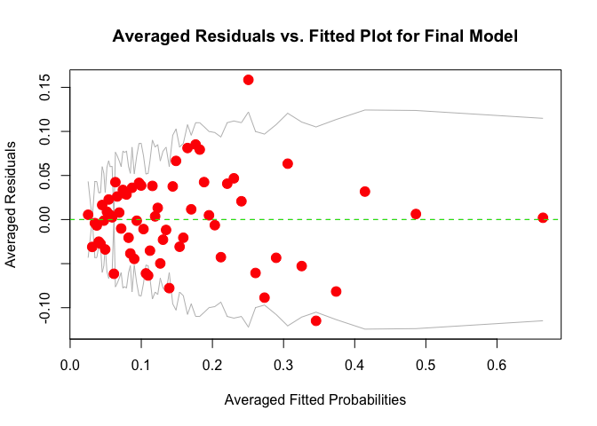

# Appendix C: Code

Authors: Seth Billiau, Katherine Deng, Karissa Huang, and Sophia Li

# Introduction

This is a code appendix for our analysis of the Framingham Heart Study
using GLMs and GAMS.

# EDA

This is the code appendix for our EDA. The goals of this exercise were
to discover missingness, visualize the distribution of the response and
predictor variables, and assess the predictor variables for obvious
signs of multicollinearity.

## Preprocessing

Read in the data and make note of missing values:

``` r
data_raw = read.csv("data/chd_risk.csv")
summary(data_raw)
```

    ##       age                     education      cigsPerDay        totChol     
    ##  Min.   :32.00   College or Higher : 473   Min.   : 0.000   Min.   :107.0  
    ##  1st Qu.:42.00   High School or GED:1253   1st Qu.: 0.000   1st Qu.:206.0  
    ##  Median :49.00   Some College      : 687   Median : 0.000   Median :234.0  
    ##  Mean   :49.58   Some High School  :1720   Mean   : 9.003   Mean   :236.7  
    ##  3rd Qu.:56.00   NA's              : 105   3rd Qu.:20.000   3rd Qu.:263.0  
    ##  Max.   :70.00                             Max.   :70.000   Max.   :696.0  
    ##                                            NA's   :29       NA's   :50     
    ##      sysBP           diaBP             BMI          heartRate     
    ##  Min.   : 83.5   Min.   : 48.00   Min.   :15.54   Min.   : 44.00  
    ##  1st Qu.:117.0   1st Qu.: 75.00   1st Qu.:23.07   1st Qu.: 68.00  
    ##  Median :128.0   Median : 82.00   Median :25.40   Median : 75.00  
    ##  Mean   :132.4   Mean   : 82.89   Mean   :25.80   Mean   : 75.88  
    ##  3rd Qu.:144.0   3rd Qu.: 89.88   3rd Qu.:28.04   3rd Qu.: 83.00  
    ##  Max.   :295.0   Max.   :142.50   Max.   :56.80   Max.   :143.00  
    ##                                   NA's   :19      NA's   :1       
    ##     glucose           sex             smoker     OnBPMeds    PrevStroke
    ##  Min.   : 40.00   female:2419   Nonsmoker:2144   No  :4061   No :4213  
    ##  1st Qu.: 71.00   male  :1819   Smoker   :2094   Yes : 124   Yes:  25  
    ##  Median : 78.00                                  NA's:  53             
    ##  Mean   : 81.97                                                        
    ##  3rd Qu.: 87.00                                                        
    ##  Max.   :394.00                                                        
    ##  NA's   :388                                                           
    ##   Hyp        Diab      CHD_Risk  
    ##  No :2922   No :4129   No :3594  
    ##  Yes:1316   Yes: 109   Yes: 644  
    ##                                  
    ##                                  
    ##                                  
    ##                                  
    ## 

``` r
length(data_raw$age)
```

    ## [1] 4238

## Check for missingness

Count number of missing predictors in each variable:

``` r
# Generate the number of missing values for each predictor
apply(is.na(data_raw), 2, sum)
```

    ##        age  education cigsPerDay    totChol      sysBP      diaBP        BMI 
    ##          0        105         29         50          0          0         19 
    ##  heartRate    glucose        sex     smoker   OnBPMeds PrevStroke        Hyp 
    ##          1        388          0          0         53          0          0 
    ##       Diab   CHD_Risk 
    ##          0          0

``` r
missing_preds = c("education", "cigsPerDay", "totChol", "BMI", 
                  "heartRate", "glucose", "OnBPMeds")
```

## Visualizing the Response

``` r
# Labels for ticks
N_label = paste("No (", round(mean(data_raw$CHD_Risk == "No"), 2)*100, "%)", sep="")
Y_label = paste("Yes (", round(mean(data_raw$CHD_Risk == "Yes"), 2)*100, "%)", sep="")

# Plot bar chart
p <- ggplot(data=data_raw, aes(x=as.factor(CHD_Risk))) +
  geom_histogram(stat="count",fill="red",
                 aes(y=..count../sum(..count..)),
                 alpha = 0.5) + 
    labs(title="Frequency of CHD_Risk") +
    xlab("CHD_Risk") +
    ylab("Frequency") +
    scale_x_discrete(breaks=c("No","Yes"), labels=c(N_label,Y_label)) +
    theme_bw()
```

    ## Warning: Ignoring unknown parameters: binwidth, bins, pad

``` r
p 
```

<!-- -->

## Visualizing the Predictors

Visualize distribution of quantitative predictors conditional on the CHD
outcome:

``` r
quant_preds = c("age", "cigsPerDay", "totChol", "sysBP", 
                  "diaBP", "BMI", "heartRate", "glucose")

make_cond_hist = function(varname) {
  p1 = ggplot(data_raw, aes_string(x=varname)) + 
    geom_histogram(aes(y = ..density..), 
                   fill = "red", alpha = 0.5) + 
    labs(title=paste(varname, "given CHD_Risk")) +
    xlab(varname) +
    ylab("Density") + 
    facet_grid(. ~ CHD_Risk) + 
    theme_bw()
  return(p1)
}

graphs = lapply(quant_preds, make_cond_hist)
figure1 = ggarrange(graphs[[1]], graphs[[2]], graphs[[3]], graphs[[4]], 
          graphs[[5]], graphs[[6]], graphs[[7]], graphs[[8]],
          ncol = 2, nrow = 4)
annotate_figure(figure1,
                top = text_grob("Visualizing Quantitative Predictors given CHD_Risk (prevalence = 0.152)", face = "bold", size = 14)
)
```


Visualizing the Qualitative predictors by showing their distributions
conditional on the outcome:

``` r
# Address Categorical predictors
cat_preds = c("education", "sex", "smoker", "OnBPMeds", 
              "PrevStroke", "Hyp", "Diab")
get_cond_prob_table = function(TABLE) { 
  col1 = TABLE[,1] / sum(TABLE[,1])
  col2 = TABLE[,2] / sum(TABLE[,2])
  return(cbind(No=col1, Yes=col2))
}
tab_education = get_cond_prob_table(table(data_raw$education, data_raw$CHD_Risk))
tab_sex = get_cond_prob_table(table(data_raw$sex, data_raw$CHD_Risk))
tab_smoker = get_cond_prob_table(table(data_raw$smoker, data_raw$CHD_Risk))
tab_OnBPMeds = get_cond_prob_table(table(data_raw$OnBPMeds, data_raw$CHD_Risk))
tab_PrevStroke = get_cond_prob_table(table(data_raw$PrevStroke, data_raw$CHD_Risk))
tab_Hyp = get_cond_prob_table(table(data_raw$Hyp, data_raw$CHD_Risk))
tab_Diab = get_cond_prob_table(table(data_raw$Diab, data_raw$CHD_Risk))

tab_prob_Yes = rbind(tab_education, tab_sex, tab_smoker, 
                     tab_OnBPMeds, tab_PrevStroke, tab_Hyp,
                     tab_Diab)
round(tab_prob_Yes,3)
```

    ##                       No   Yes
    ## College or Higher  0.115 0.111
    ## High School or GED 0.316 0.234
    ## Some College       0.171 0.140
    ## Some High School   0.399 0.514
    ## female             0.589 0.467
    ## male               0.411 0.533
    ## Nonsmoker          0.510 0.483
    ## Smoker             0.490 0.517
    ## No                 0.977 0.935
    ## Yes                0.023 0.065
    ## No                 0.996 0.983
    ## Yes                0.004 0.017
    ## No                 0.724 0.495
    ## Yes                0.276 0.505
    ## No                 0.981 0.938
    ## Yes                0.019 0.062

Check for collinearity with GVIF.

``` r
# Check for multicollinearity
mod.vif.lm <- lm(as.numeric(CHD_Risk) ~ ., data=data_raw)
vif(mod.vif.lm)
```

    ##                GVIF Df GVIF^(1/(2*Df))
    ## age        1.397737  1        1.182259
    ## education  1.124453  3        1.019742
    ## cigsPerDay 2.732416  1        1.653002
    ## totChol    1.116842  1        1.056808
    ## sysBP      3.767158  1        1.940917
    ## diaBP      3.000260  1        1.732126
    ## BMI        1.246685  1        1.116550
    ## heartRate  1.095015  1        1.046429
    ## glucose    1.638312  1        1.279966
    ## sex        1.223718  1        1.106218
    ## smoker     2.585357  1        1.607904
    ## OnBPMeds   1.111774  1        1.054407
    ## PrevStroke 1.017647  1        1.008785
    ## Hyp        2.051447  1        1.432287
    ## Diab       1.616622  1        1.271465

Because all values in the last column are less than 3.1623, there is not
significant/strong evidence of multicollinearity.

# Models

This is the code appendix for our modeling section.

## Begin Building a Model - NaN Values Removed

``` r
data = read.csv("data/chd_risk.csv")
# force smoker from categorical to numeric
data$smoker = unclass(data$smoker)
data_na = na.omit(data)
nrow(data_na)
```

    ## [1] 3656

``` r
nrow(data)
```

    ## [1] 4238

Fit a glm with individual predictors, smoker and cigPerDay are
multiplied based on first principles.

``` r
glm_all = glm(CHD_Risk ~ age + education + totChol + sysBP + diaBP + BMI + heartRate + glucose + sex + smoker:cigsPerDay + OnBPMeds + PrevStroke + Hyp + Diab, family = binomial, data = data_na)
summary(glm_all)
```

    ## 
    ## Call:
    ## glm(formula = CHD_Risk ~ age + education + totChol + sysBP + 
    ##     diaBP + BMI + heartRate + glucose + sex + smoker:cigsPerDay + 
    ##     OnBPMeds + PrevStroke + Hyp + Diab, family = binomial, data = data_na)
    ## 
    ## Deviance Residuals: 
    ##     Min       1Q   Median       3Q      Max  
    ## -1.9363  -0.5940  -0.4232  -0.2837   2.8682  
    ## 
    ## Coefficients:
    ##                              Estimate Std. Error z value Pr(>|z|)    
    ## (Intercept)                 -8.271975   0.699437 -11.827  < 2e-16 ***
    ## age                          0.061962   0.006742   9.191  < 2e-16 ***
    ## educationHigh School or GED -0.131590   0.177573  -0.741  0.45866    
    ## educationSome College       -0.135339   0.197504  -0.685  0.49319    
    ## educationSome High School    0.059549   0.164592   0.362  0.71750    
    ## totChol                      0.002362   0.001129   2.091  0.03650 *  
    ## sysBP                        0.015474   0.003810   4.061 4.88e-05 ***
    ## diaBP                       -0.004169   0.006441  -0.647  0.51745    
    ## BMI                          0.004476   0.012708   0.352  0.72471    
    ## heartRate                   -0.002966   0.004211  -0.704  0.48120    
    ## glucose                      0.007211   0.002235   3.226  0.00126 ** 
    ## sexmale                      0.534588   0.109948   4.862 1.16e-06 ***
    ## OnBPMedsYes                  0.165180   0.234415   0.705  0.48103    
    ## PrevStrokeYes                0.702450   0.491151   1.430  0.15266    
    ## HypYes                       0.233504   0.138183   1.690  0.09106 .  
    ## DiabYes                      0.025323   0.316114   0.080  0.93615    
    ## smoker:cigsPerDay            0.010064   0.002117   4.753 2.00e-06 ***
    ## ---
    ## Signif. codes:  0 '***' 0.001 '**' 0.01 '*' 0.05 '.' 0.1 ' ' 1
    ## 
    ## (Dispersion parameter for binomial family taken to be 1)
    ## 
    ##     Null deviance: 3120.5  on 3655  degrees of freedom
    ## Residual deviance: 2752.1  on 3639  degrees of freedom
    ## AIC: 2786.1
    ## 
    ## Number of Fisher Scoring iterations: 5

Beginning analysis of deviance table. Decided not to do 1-term models
with every predictor because that would take forever, so I used the Wald
test predictors.

``` r
glm0 = glm(CHD_Risk ~ 1, family = binomial, data = data_na)
glm1 = glm(CHD_Risk ~ 1 + age, family = binomial, data = data_na)
glm2 = glm(CHD_Risk ~ 1 + sysBP, family = binomial, data = data_na)
glm3 = glm(CHD_Risk ~ 1 + sex, family = binomial, data = data_na)
glm4 = glm(CHD_Risk ~ 1 + smoker:cigsPerDay, family = binomial, data = data_na)

# age is the best
glm5 = glm(CHD_Risk ~ 1 + age + sysBP, family = binomial, data = data_na)
glm6 = glm(CHD_Risk ~ 1 + age + sex, family = binomial, data = data_na)
glm7 = glm(CHD_Risk ~ 1 + age + smoker:cigsPerDay, family = binomial, data = data_na)

# baseline age + sysBP
glm8 = glm(CHD_Risk ~ 1 + age + sysBP + sex, family = binomial, data = data_na)
glm9 = glm(CHD_Risk ~ 1 + age + sysBP + smoker:cigsPerDay, family = binomial, data = data_na)

# baseline age + sysBP + sex
glm10 = glm(CHD_Risk ~ 1 + age + sysBP + sex + smoker:cigsPerDay, family = binomial, data = data_na)

# m working model 
m = glm10

summary(glm10)
```

    ## 
    ## Call:
    ## glm(formula = CHD_Risk ~ 1 + age + sysBP + sex + smoker:cigsPerDay, 
    ##     family = binomial, data = data_na)
    ## 
    ## Deviance Residuals: 
    ##     Min       1Q   Median       3Q      Max  
    ## -1.5371  -0.5981  -0.4338  -0.2943   2.8106  
    ## 
    ## Coefficients:
    ##                    Estimate Std. Error z value Pr(>|z|)    
    ## (Intercept)       -8.251467   0.403019 -20.474  < 2e-16 ***
    ## age                0.068383   0.006346  10.776  < 2e-16 ***
    ## sysBP              0.018783   0.002127   8.829  < 2e-16 ***
    ## sexmale            0.537207   0.105146   5.109 3.24e-07 ***
    ## smoker:cigsPerDay  0.009354   0.002072   4.514 6.37e-06 ***
    ## ---
    ## Signif. codes:  0 '***' 0.001 '**' 0.01 '*' 0.05 '.' 0.1 ' ' 1
    ## 
    ## (Dispersion parameter for binomial family taken to be 1)
    ## 
    ##     Null deviance: 3120.5  on 3655  degrees of freedom
    ## Residual deviance: 2785.6  on 3651  degrees of freedom
    ## AIC: 2795.6
    ## 
    ## Number of Fisher Scoring iterations: 5

``` r
# anova(m, glm10, test = "Chisq")
```

Continuing analysis of deviance - checking how each of the other 10
predictors adds to age, sex, sysBP, and smoker:cigsPerDay.

``` r
m = glm10
glm11 = glm(CHD_Risk ~ 1 + age + sysBP + sex + smoker:cigsPerDay + education, family = binomial, data = data_na)
glm12 = glm(CHD_Risk ~ 1 + age + sysBP + sex + smoker:cigsPerDay + totChol, family = binomial, data = data_na)
glm13 = glm(CHD_Risk ~ 1 + age + sysBP + sex + smoker:cigsPerDay + diaBP, family = binomial, data = data_na)
glm14 = glm(CHD_Risk ~ 1 + age + sysBP + sex + smoker:cigsPerDay + BMI, family = binomial, data = data_na)
glm15 = glm(CHD_Risk ~ 1 + age + sysBP + sex + smoker:cigsPerDay + heartRate, family = binomial, data = data_na)
glm16 = glm(CHD_Risk ~ 1 + age + sysBP + sex + smoker:cigsPerDay + glucose, family = binomial, data = data_na)
glm17 = glm(CHD_Risk ~ 1 + age + sysBP + sex + smoker:cigsPerDay + OnBPMeds, family = binomial, data = data_na)
glm18 = glm(CHD_Risk ~ 1 + age + sysBP + sex + smoker:cigsPerDay + PrevStroke, family = binomial, data = data_na)
glm19 = glm(CHD_Risk ~ 1 + age + sysBP + sex + smoker:cigsPerDay + Hyp, family = binomial, data = data_na)
glm20 = glm(CHD_Risk ~ 1 + age + sysBP + sex + smoker:cigsPerDay + Diab, family = binomial, data = data_na)

# Should use a for loop here to examine deviance of each model
x = summary(glm20)
print(x$call)
```

    ## glm(formula = CHD_Risk ~ 1 + age + sysBP + sex + smoker:cigsPerDay + 
    ##     Diab, family = binomial, data = data_na)

``` r
print(x$deviance)
```

    ## [1] 2776.522

``` r
anova(glm16, m, test="Chisq")
```

    ## Analysis of Deviance Table
    ## 
    ## Model 1: CHD_Risk ~ 1 + age + sysBP + sex + smoker:cigsPerDay + glucose
    ## Model 2: CHD_Risk ~ 1 + age + sysBP + sex + smoker:cigsPerDay
    ##   Resid. Df Resid. Dev Df Deviance  Pr(>Chi)    
    ## 1      3650     2766.5                          
    ## 2      3651     2785.6 -1  -19.102 1.239e-05 ***
    ## ---
    ## Signif. codes:  0 '***' 0.001 '**' 0.01 '*' 0.05 '.' 0.1 ' ' 1

Baseline model: age, sysBP, sex, smoker:cigsPerDay, glucose.

Now, look for next predictor\! Ignore diaBP and heartrate for now.

``` r
m = glm16
glm17 = glm(CHD_Risk ~ 1 + age + sysBP + sex + smoker:cigsPerDay + glucose + education, family = binomial, data = data_na)
glm18 = glm(CHD_Risk ~ 1 + age + sysBP + sex + smoker:cigsPerDay + glucose + totChol, family = binomial, data = data_na)
glm19 = glm(CHD_Risk ~ 1 + age + sysBP + sex + smoker:cigsPerDay + glucose + BMI, family = binomial, data = data_na)
glm20 = glm(CHD_Risk ~ 1 + age + sysBP + sex + smoker:cigsPerDay + glucose + OnBPMeds, family = binomial, data = data_na)
glm21 = glm(CHD_Risk ~ 1 + age + sysBP + sex + smoker:cigsPerDay + glucose + PrevStroke, family = binomial, data = data_na)
glm22 = glm(CHD_Risk ~ 1 + age + sysBP + sex + smoker:cigsPerDay + glucose + Hyp, family = binomial, data = data_na)
glm23 = glm(CHD_Risk ~ 1 + age + sysBP + sex + smoker:cigsPerDay + glucose + Diab, family = binomial, data = data_na)

pred6 <- list(glm17, glm18, glm19, glm20, glm21, glm22, glm23)
for (model_i in pred6){
  print(model_i$call)
  print(model_i$deviance)
}
```

    ## glm(formula = CHD_Risk ~ 1 + age + sysBP + sex + smoker:cigsPerDay + 
    ##     glucose + education, family = binomial, data = data_na)
    ## [1] 2763.365
    ## glm(formula = CHD_Risk ~ 1 + age + sysBP + sex + smoker:cigsPerDay + 
    ##     glucose + totChol, family = binomial, data = data_na)
    ## [1] 2762.476
    ## glm(formula = CHD_Risk ~ 1 + age + sysBP + sex + smoker:cigsPerDay + 
    ##     glucose + BMI, family = binomial, data = data_na)
    ## [1] 2766.02
    ## glm(formula = CHD_Risk ~ 1 + age + sysBP + sex + smoker:cigsPerDay + 
    ##     glucose + OnBPMeds, family = binomial, data = data_na)
    ## [1] 2765.325
    ## glm(formula = CHD_Risk ~ 1 + age + sysBP + sex + smoker:cigsPerDay + 
    ##     glucose + PrevStroke, family = binomial, data = data_na)
    ## [1] 2764.056
    ## glm(formula = CHD_Risk ~ 1 + age + sysBP + sex + smoker:cigsPerDay + 
    ##     glucose + Hyp, family = binomial, data = data_na)
    ## [1] 2763.422
    ## glm(formula = CHD_Risk ~ 1 + age + sysBP + sex + smoker:cigsPerDay + 
    ##     glucose + Diab, family = binomial, data = data_na)
    ## [1] 2766.465

``` r
anova(m, glm18, test = "Chisq")
```

    ## Analysis of Deviance Table
    ## 
    ## Model 1: CHD_Risk ~ 1 + age + sysBP + sex + smoker:cigsPerDay + glucose
    ## Model 2: CHD_Risk ~ 1 + age + sysBP + sex + smoker:cigsPerDay + glucose + 
    ##     totChol
    ##   Resid. Df Resid. Dev Df Deviance Pr(>Chi)  
    ## 1      3650     2766.5                       
    ## 2      3649     2762.5  1   4.0507  0.04415 *
    ## ---
    ## Signif. codes:  0 '***' 0.001 '**' 0.01 '*' 0.05 '.' 0.1 ' ' 1

Working model is glm18:
\(age + sysBP + sex + smoker:cigsPerDay + glucose + totChol\). Look for
7th predictors.

``` r
m = glm18
glm24 = glm(CHD_Risk ~ 1 + age + sysBP + sex + smoker:cigsPerDay + glucose + totChol + education, family = binomial, data = data_na)
glm25 = glm(CHD_Risk ~ 1 + age + sysBP + sex + smoker:cigsPerDay + glucose + totChol + OnBPMeds, family = binomial, data = data_na)
glm26 = glm(CHD_Risk ~ 1 + age + sysBP + sex + smoker:cigsPerDay + glucose + totChol + PrevStroke, family = binomial, data = data_na)
glm27 = glm(CHD_Risk ~ 1 + age + sysBP + sex + smoker:cigsPerDay + glucose + totChol + Hyp, family = binomial, data = data_na)
glm28 = glm(CHD_Risk ~ 1 + age + sysBP + sex + smoker:cigsPerDay + glucose + totChol + diaBP, family = binomial, data = data_na)
glm29 = glm(CHD_Risk ~ 1 + age + sysBP + sex + smoker:cigsPerDay + glucose + totChol + heartRate, family = binomial, data = data_na)


pred7 <- list(glm24, glm25, glm26, glm27, glm28, glm29)
for (model_i in pred7){
  print(model_i$call)
  print(model_i$deviance)
}
```

    ## glm(formula = CHD_Risk ~ 1 + age + sysBP + sex + smoker:cigsPerDay + 
    ##     glucose + totChol + education, family = binomial, data = data_na)
    ## [1] 2758.95
    ## glm(formula = CHD_Risk ~ 1 + age + sysBP + sex + smoker:cigsPerDay + 
    ##     glucose + totChol + OnBPMeds, family = binomial, data = data_na)
    ## [1] 2761.409
    ## glm(formula = CHD_Risk ~ 1 + age + sysBP + sex + smoker:cigsPerDay + 
    ##     glucose + totChol + PrevStroke, family = binomial, data = data_na)
    ## [1] 2759.98
    ## glm(formula = CHD_Risk ~ 1 + age + sysBP + sex + smoker:cigsPerDay + 
    ##     glucose + totChol + Hyp, family = binomial, data = data_na)
    ## [1] 2759.479
    ## glm(formula = CHD_Risk ~ 1 + age + sysBP + sex + smoker:cigsPerDay + 
    ##     glucose + totChol + diaBP, family = binomial, data = data_na)
    ## [1] 2762.34
    ## glm(formula = CHD_Risk ~ 1 + age + sysBP + sex + smoker:cigsPerDay + 
    ##     glucose + totChol + heartRate, family = binomial, data = data_na)
    ## [1] 2761.966

``` r
anova(m, glm24, test = "Chisq")
```

    ## Analysis of Deviance Table
    ## 
    ## Model 1: CHD_Risk ~ 1 + age + sysBP + sex + smoker:cigsPerDay + glucose + 
    ##     totChol
    ## Model 2: CHD_Risk ~ 1 + age + sysBP + sex + smoker:cigsPerDay + glucose + 
    ##     totChol + education
    ##   Resid. Df Resid. Dev Df Deviance Pr(>Chi)
    ## 1      3649     2762.5                     
    ## 2      3646     2758.9  3   3.5264   0.3174

Interaction terms

``` r
int1 = glm(CHD_Risk ~ 1 + age + sysBP + sex + smoker:cigsPerDay + glucose + totChol + age:sysBP, family = binomial, data = data_na)
int2 = glm(CHD_Risk ~ 1 + age + sysBP + sex + smoker:cigsPerDay + glucose + totChol + age:sex, family = binomial, data = data_na)
int3 = glm(CHD_Risk ~ 1 + age + sysBP + sex + smoker:cigsPerDay + glucose + totChol + age:smoker:cigsPerDay, family = binomial, data = data_na)
int4 = glm(CHD_Risk ~ 1 + age + sysBP + sex + smoker:cigsPerDay + glucose + totChol + age:glucose, family = binomial, data = data_na)
int5 = glm(CHD_Risk ~ 1 + age + sysBP + sex + smoker:cigsPerDay + glucose + totChol + age:totChol, family = binomial, data = data_na)
int6 = glm(CHD_Risk ~ 1 + age + sysBP + sex + smoker:cigsPerDay + glucose + totChol + sysBP:sex, family = binomial, data = data_na)
int7 = glm(CHD_Risk ~ 1 + age + sysBP + sex + smoker:cigsPerDay + glucose + totChol + sysBP:smoker:cigsPerDay, family = binomial, data = data_na)
int8 = glm(CHD_Risk ~ 1 + age + sysBP + sex + smoker:cigsPerDay + glucose + totChol + sysBP:glucose, family = binomial, data = data_na)
int9 = glm(CHD_Risk ~ 1 + age + sysBP + sex + smoker:cigsPerDay + glucose + totChol + sysBP:totChol, family = binomial, data = data_na)
int10 = glm(CHD_Risk ~ 1 + age + sysBP + sex + smoker:cigsPerDay + glucose + totChol + sex:smoker:cigsPerDay, family = binomial, data = data_na)
int11 = glm(CHD_Risk ~ 1 + age + sysBP + sex + smoker:cigsPerDay + glucose + totChol + sex:glucose, family = binomial, data = data_na)
int12 = glm(CHD_Risk ~ 1 + age + sysBP + sex + smoker:cigsPerDay + glucose + totChol + sex:totChol, family = binomial, data = data_na)
int13 = glm(CHD_Risk ~ 1 + age + sysBP + sex + smoker:cigsPerDay + glucose + totChol + smoker:cigsPerDay:glucose, family = binomial, data = data_na)
int14 = glm(CHD_Risk ~ 1 + age + sysBP + sex + smoker:cigsPerDay + glucose + totChol + smoker:cigsPerDay:totChol, family = binomial, data = data_na)
int15 = glm(CHD_Risk ~ 1 + age + sysBP + sex + smoker:cigsPerDay + glucose + totChol + glucose:totChol, family = binomial, data = data_na)

inter1 <- list(int1, int2, int3, int4, int5, int6, int7, int8, int9, int10, int11, int12, int13, int14, int15)
for (model_i in inter1){
  print(model_i$call)
  print(model_i$deviance)
}
```

    ## glm(formula = CHD_Risk ~ 1 + age + sysBP + sex + smoker:cigsPerDay + 
    ##     glucose + totChol + age:sysBP, family = binomial, data = data_na)
    ## [1] 2761.898
    ## glm(formula = CHD_Risk ~ 1 + age + sysBP + sex + smoker:cigsPerDay + 
    ##     glucose + totChol + age:sex, family = binomial, data = data_na)
    ## [1] 2762.233
    ## glm(formula = CHD_Risk ~ 1 + age + sysBP + sex + smoker:cigsPerDay + 
    ##     glucose + totChol + age:smoker:cigsPerDay, family = binomial, 
    ##     data = data_na)
    ## [1] 2761.905
    ## glm(formula = CHD_Risk ~ 1 + age + sysBP + sex + smoker:cigsPerDay + 
    ##     glucose + totChol + age:glucose, family = binomial, data = data_na)
    ## [1] 2762.468
    ## glm(formula = CHD_Risk ~ 1 + age + sysBP + sex + smoker:cigsPerDay + 
    ##     glucose + totChol + age:totChol, family = binomial, data = data_na)
    ## [1] 2760.629
    ## glm(formula = CHD_Risk ~ 1 + age + sysBP + sex + smoker:cigsPerDay + 
    ##     glucose + totChol + sysBP:sex, family = binomial, data = data_na)
    ## [1] 2760.044
    ## glm(formula = CHD_Risk ~ 1 + age + sysBP + sex + smoker:cigsPerDay + 
    ##     glucose + totChol + sysBP:smoker:cigsPerDay, family = binomial, 
    ##     data = data_na)
    ## [1] 2762.39
    ## glm(formula = CHD_Risk ~ 1 + age + sysBP + sex + smoker:cigsPerDay + 
    ##     glucose + totChol + sysBP:glucose, family = binomial, data = data_na)
    ## [1] 2762.476
    ## glm(formula = CHD_Risk ~ 1 + age + sysBP + sex + smoker:cigsPerDay + 
    ##     glucose + totChol + sysBP:totChol, family = binomial, data = data_na)
    ## [1] 2762.268
    ## glm(formula = CHD_Risk ~ 1 + age + sysBP + sex + smoker:cigsPerDay + 
    ##     glucose + totChol + sex:smoker:cigsPerDay, family = binomial, 
    ##     data = data_na)
    ## [1] 2761.693
    ## glm(formula = CHD_Risk ~ 1 + age + sysBP + sex + smoker:cigsPerDay + 
    ##     glucose + totChol + sex:glucose, family = binomial, data = data_na)
    ## [1] 2762.258
    ## glm(formula = CHD_Risk ~ 1 + age + sysBP + sex + smoker:cigsPerDay + 
    ##     glucose + totChol + sex:totChol, family = binomial, data = data_na)
    ## [1] 2759.904
    ## glm(formula = CHD_Risk ~ 1 + age + sysBP + sex + smoker:cigsPerDay + 
    ##     glucose + totChol + smoker:cigsPerDay:glucose, family = binomial, 
    ##     data = data_na)
    ## [1] 2761.937
    ## glm(formula = CHD_Risk ~ 1 + age + sysBP + sex + smoker:cigsPerDay + 
    ##     glucose + totChol + smoker:cigsPerDay:totChol, family = binomial, 
    ##     data = data_na)
    ## [1] 2762.429
    ## glm(formula = CHD_Risk ~ 1 + age + sysBP + sex + smoker:cigsPerDay + 
    ##     glucose + totChol + glucose:totChol, family = binomial, data = data_na)
    ## [1] 2759.187

``` r
anova(m, int15, test = "Chisq")
```

    ## Analysis of Deviance Table
    ## 
    ## Model 1: CHD_Risk ~ 1 + age + sysBP + sex + smoker:cigsPerDay + glucose + 
    ##     totChol
    ## Model 2: CHD_Risk ~ 1 + age + sysBP + sex + smoker:cigsPerDay + glucose + 
    ##     totChol + glucose:totChol
    ##   Resid. Df Resid. Dev Df Deviance Pr(>Chi)  
    ## 1      3649     2762.5                       
    ## 2      3648     2759.2  1   3.2892  0.06974 .
    ## ---
    ## Signif. codes:  0 '***' 0.001 '**' 0.01 '*' 0.05 '.' 0.1 ' ' 1

## Final GLM

``` r
final.glm = glm(CHD_Risk ~ 1 + age + sysBP + sex + smoker:cigsPerDay + glucose + totChol, family = binomial, data = data_na)
```

## Model Fit

Examine model fit

``` r
summary(m)
```

    ## 
    ## Call:
    ## glm(formula = CHD_Risk ~ 1 + age + sysBP + sex + smoker:cigsPerDay + 
    ##     glucose + totChol, family = binomial, data = data_na)
    ## 
    ## Deviance Residuals: 
    ##     Min       1Q   Median       3Q      Max  
    ## -2.0074  -0.5966  -0.4315  -0.2864   2.8811  
    ## 
    ## Coefficients:
    ##                    Estimate Std. Error z value Pr(>|z|)    
    ## (Intercept)       -9.129843   0.475530 -19.199  < 2e-16 ***
    ## age                0.065896   0.006426  10.254  < 2e-16 ***
    ## sysBP              0.017534   0.002149   8.159 3.38e-16 ***
    ## sexmale            0.561446   0.106845   5.255 1.48e-07 ***
    ## glucose            0.007280   0.001677   4.342 1.41e-05 ***
    ## totChol            0.002272   0.001123   2.024    0.043 *  
    ## smoker:cigsPerDay  0.009613   0.002088   4.604 4.14e-06 ***
    ## ---
    ## Signif. codes:  0 '***' 0.001 '**' 0.01 '*' 0.05 '.' 0.1 ' ' 1
    ## 
    ## (Dispersion parameter for binomial family taken to be 1)
    ## 
    ##     Null deviance: 3120.5  on 3655  degrees of freedom
    ## Residual deviance: 2762.5  on 3649  degrees of freedom
    ## AIC: 2776.5
    ## 
    ## Number of Fisher Scoring iterations: 5

``` r
3120.5 / 3655 # residual deviance / df
```

    ## [1] 0.853762

``` r
# hosmer-lemeshow function (source: lowbwt-03.R)
hosmerlem = function (y, yhat, g = 10) {
  cutyhat = cut(yhat, breaks = quantile(yhat, probs = seq(0, 1, 1/g)), 
                include.lowest = T)
  obs = xtabs(cbind(1 - y, y) ~ cutyhat)
  expect = xtabs(cbind(1 - yhat, yhat) ~ cutyhat)
  chisq = sum((obs - expect)^2 / expect)
  P = 1 - pchisq(chisq, g - 2)
  c("X^2" = chisq, Df = g - 2, "P(>Chi)" = P)
}

# try different values of g to see if results are sensitive to choice
hosmerlem(m$y, fitted(m)) # g = 10
```

    ##       X^2        Df   P(>Chi) 
    ## 7.7444719 8.0000000 0.4588206

``` r
hosmerlem(m$y, fitted(m), g = 5) # g = 5
```

    ##       X^2        Df   P(>Chi) 
    ## 2.0660066 3.0000000 0.5588204

``` r
hosmerlem(m$y, fitted(m), g = 15) # g = 15
```

    ##        X^2         Df    P(>Chi) 
    ## 16.4053024 13.0000000  0.2279345

## Diagnostics

``` r
# plot averaged residuals vs. fitted probabilities
binnedplot(fitted(m), residuals(m, type = "response"),
  xlab = "Averaged Fitted Probabilities",
  ylab = "Averaged Residuals",
  pch = 19, col.pts = "red", cex.pts = 1.5,
  main = "Averaged Residuals vs. Fitted Plot for Final Model")
abline(h = 0, lty = 2, col = "green")
```

<!-- -->

``` r
# plot cook's distances
plot(cooks.distance(m), type = "h", lwd = 2,
  xlab = "Observation Index",
  ylab = "Cook's Distances",
  main = "Cook's Distances for Final Model")
abline(h = 1, lty = 2, col = "red")
```

<!-- -->

## Begin Building a Model - na.convert.mean

Reprocess data:

``` r
# Begin building model
data = read.csv("data/chd_risk.csv")
# force smoker from categorical to numeric
data$smoker = unclass(data$smoker)
data_na = na.convert.mean(data)
```

GLM with individual predictors, smoker and cigPerDay are combined based
on first principles.

``` r
glm_all = glm(CHD_Risk ~ age + education + totChol + sysBP + diaBP + BMI + heartRate + glucose + sex + smoker:cigsPerDay + OnBPMeds + PrevStroke + Hyp + Diab + cigsPerDay.na + totChol.na + BMI.na + heartRate.na + glucose.na, family = binomial, data = data_na)
summary(glm_all)
```

    ## 
    ## Call:
    ## glm(formula = CHD_Risk ~ age + education + totChol + sysBP + 
    ##     diaBP + BMI + heartRate + glucose + sex + smoker:cigsPerDay + 
    ##     OnBPMeds + PrevStroke + Hyp + Diab + cigsPerDay.na + totChol.na + 
    ##     BMI.na + heartRate.na + glucose.na, family = binomial, data = data_na)
    ## 
    ## Deviance Residuals: 
    ##     Min       1Q   Median       3Q      Max  
    ## -1.9646  -0.5913  -0.4271  -0.2884   2.8544  
    ## 
    ## Coefficients:
    ##                               Estimate Std. Error z value Pr(>|z|)    
    ## (Intercept)                  -7.879165   0.741040 -10.633  < 2e-16 ***
    ## age                           0.060012   0.006292   9.538  < 2e-16 ***
    ## educationHigh School or GED  -0.224931   0.165792  -1.357  0.17487    
    ## educationNA                  -0.151727   0.316847  -0.479  0.63204    
    ## educationSome College        -0.116754   0.182979  -0.638  0.52343    
    ## educationSome High School    -0.023614   0.153580  -0.154  0.87780    
    ## totChol                       0.002054   0.001033   1.988  0.04681 *  
    ## sysBP                         0.014009   0.003567   3.927 8.59e-05 ***
    ## diaBP                        -0.002176   0.006012  -0.362  0.71734    
    ## BMI                           0.001837   0.011808   0.156  0.87634    
    ## heartRate                    -0.001352   0.003902  -0.346  0.72909    
    ## glucose                       0.007098   0.002168   3.274  0.00106 ** 
    ## sexmale                       0.498590   0.102658   4.857 1.19e-06 ***
    ## OnBPMedsNo                   -0.164830   0.362178  -0.455  0.64903    
    ## OnBPMedsYes                   0.085136   0.415618   0.205  0.83770    
    ## PrevStrokeYes                 0.829163   0.460535   1.800  0.07179 .  
    ## HypYes                        0.225356   0.129105   1.746  0.08089 .  
    ## DiabYes                       0.128827   0.297999   0.432  0.66552    
    ## cigsPerDay.na                -0.780859   0.747725  -1.044  0.29634    
    ## totChol.na                    0.222566   0.413593   0.538  0.59049    
    ## BMI.na                        2.131373   0.546400   3.901 9.59e-05 ***
    ## heartRate.na                 12.377992 324.743752   0.038  0.96960    
    ## glucose.na                   -0.098080   0.176282  -0.556  0.57795    
    ## smoker:cigsPerDay             0.010847   0.001965   5.520 3.39e-08 ***
    ## ---
    ## Signif. codes:  0 '***' 0.001 '**' 0.01 '*' 0.05 '.' 0.1 ' ' 1
    ## 
    ## (Dispersion parameter for binomial family taken to be 1)
    ## 
    ##     Null deviance: 3611.5  on 4237  degrees of freedom
    ## Residual deviance: 3189.0  on 4214  degrees of freedom
    ## AIC: 3237
    ## 
    ## Number of Fisher Scoring iterations: 11

Beginning analysis of deviance table. We decided not to do 1-term models
with every predictor because that would take forever, so we used the
Wald test predictors.

``` r
glm0 = glm(CHD_Risk ~ 1, family = binomial, data = data_na)
glm1 = glm(CHD_Risk ~ 1 + age, family = binomial, data = data_na)
glm2 = glm(CHD_Risk ~ 1 + sysBP, family = binomial, data = data_na)
glm3 = glm(CHD_Risk ~ 1 + sex, family = binomial, data = data_na)
glm4 = glm(CHD_Risk ~ 1 + smoker:cigsPerDay, family = binomial, data = data_na)
glm4b = glm(CHD_Risk ~ 1 + BMI.na, family = binomial, data = data_na)

pred1 <- list(glm0, glm1, glm2, glm3, glm4, glm4b)
for (model_i in pred1){
  print(summary(model_i)$call)
  print(summary(model_i)$deviance)
}
```

    ## glm(formula = CHD_Risk ~ 1, family = binomial, data = data_na)
    ## [1] 3611.55
    ## glm(formula = CHD_Risk ~ 1 + age, family = binomial, data = data_na)
    ## [1] 3396.326
    ## glm(formula = CHD_Risk ~ 1 + sysBP, family = binomial, data = data_na)
    ## [1] 3432.642
    ## glm(formula = CHD_Risk ~ 1 + sex, family = binomial, data = data_na)
    ## [1] 3578.741
    ## glm(formula = CHD_Risk ~ 1 + smoker:cigsPerDay, family = binomial, 
    ##     data = data_na)
    ## [1] 3597.986
    ## glm(formula = CHD_Risk ~ 1 + BMI.na, family = binomial, data = data_na)
    ## [1] 3597.093

``` r
m = glm0
anova(m, glm1, test="Chisq")
```

    ## Analysis of Deviance Table
    ## 
    ## Model 1: CHD_Risk ~ 1
    ## Model 2: CHD_Risk ~ 1 + age
    ##   Resid. Df Resid. Dev Df Deviance  Pr(>Chi)    
    ## 1      4237     3611.5                          
    ## 2      4236     3396.3  1   215.22 < 2.2e-16 ***
    ## ---
    ## Signif. codes:  0 '***' 0.001 '**' 0.01 '*' 0.05 '.' 0.1 ' ' 1

Age is the best predictor. Continue Analysis of deviance:

``` r
m = glm1

glm5 = glm(CHD_Risk ~ 1 + age + sysBP, family = binomial, data = data_na)
glm6 = glm(CHD_Risk ~ 1 + age + sex, family = binomial, data = data_na)
glm7 = glm(CHD_Risk ~ 1 + age + smoker:cigsPerDay, family = binomial, data = data_na)
glm7b = glm(CHD_Risk ~ 1 + age + BMI.na, family = binomial, data = data_na)
pred2 <- list(glm5, glm6, glm7, glm7b)
for (model_i in pred2){
  print(summary(model_i)$call)
  print(summary(model_i)$deviance)
}
```

    ## glm(formula = CHD_Risk ~ 1 + age + sysBP, family = binomial, 
    ##     data = data_na)
    ## [1] 3325.673
    ## glm(formula = CHD_Risk ~ 1 + age + sex, family = binomial, data = data_na)
    ## [1] 3356.181
    ## glm(formula = CHD_Risk ~ 1 + age + smoker:cigsPerDay, family = binomial, 
    ##     data = data_na)
    ## [1] 3347.071
    ## glm(formula = CHD_Risk ~ 1 + age + BMI.na, family = binomial, 
    ##     data = data_na)
    ## [1] 3383.409

``` r
anova(m, glm5, test="Chisq")
```

    ## Analysis of Deviance Table
    ## 
    ## Model 1: CHD_Risk ~ 1 + age
    ## Model 2: CHD_Risk ~ 1 + age + sysBP
    ##   Resid. Df Resid. Dev Df Deviance  Pr(>Chi)    
    ## 1      4236     3396.3                          
    ## 2      4235     3325.7  1   70.653 < 2.2e-16 ***
    ## ---
    ## Signif. codes:  0 '***' 0.001 '**' 0.01 '*' 0.05 '.' 0.1 ' ' 1

sysBP is the best predictor. Continue Analysis of deviance:

``` r
m = glm5
# baseline age + sysBP
glm8 = glm(CHD_Risk ~ 1 + age + sysBP + sex, family = binomial, data = data_na)
glm9 = glm(CHD_Risk ~ 1 + age + sysBP + smoker:cigsPerDay, family = binomial, data = data_na)
glm9b = glm(CHD_Risk ~ 1 + age + sysBP + BMI.na, family = binomial, data = data_na)
pred3 <- list(glm8, glm9, glm9b)
for (model_i in pred3){
  print(summary(model_i)$call)
  print(summary(model_i)$deviance)
}
```

    ## glm(formula = CHD_Risk ~ 1 + age + sysBP + sex, family = binomial, 
    ##     data = data_na)
    ## [1] 3273.349
    ## glm(formula = CHD_Risk ~ 1 + age + sysBP + smoker:cigsPerDay, 
    ##     family = binomial, data = data_na)
    ## [1] 3272.317
    ## glm(formula = CHD_Risk ~ 1 + age + sysBP + BMI.na, family = binomial, 
    ##     data = data_na)
    ## [1] 3313.134

``` r
anova(m, glm9, test="Chisq")
```

    ## Analysis of Deviance Table
    ## 
    ## Model 1: CHD_Risk ~ 1 + age + sysBP
    ## Model 2: CHD_Risk ~ 1 + age + sysBP + smoker:cigsPerDay
    ##   Resid. Df Resid. Dev Df Deviance  Pr(>Chi)    
    ## 1      4235     3325.7                          
    ## 2      4234     3272.3  1   53.356 2.782e-13 ***
    ## ---
    ## Signif. codes:  0 '***' 0.001 '**' 0.01 '*' 0.05 '.' 0.1 ' ' 1

smoker:cigsPerDay is the best predictor. Continue Analysis of deviance:

``` r
m = glm9
# baseline age + sysBP + smoker:cigsPerDay
glm10 = glm(CHD_Risk ~ 1 + age + sysBP + smoker:cigsPerDay + sex, family = binomial, data = data_na)
glm10b = glm(CHD_Risk ~ 1 + age + sysBP + smoker:cigsPerDay + BMI.na, family = binomial, data = data_na)

for (i in list(glm10, glm10b)){
  print(summary(i)$call)
  print(summary(i)$deviance)
}
```

    ## glm(formula = CHD_Risk ~ 1 + age + sysBP + smoker:cigsPerDay + 
    ##     sex, family = binomial, data = data_na)
    ## [1] 3245.906
    ## glm(formula = CHD_Risk ~ 1 + age + sysBP + smoker:cigsPerDay + 
    ##     BMI.na, family = binomial, data = data_na)
    ## [1] 3258.933

Continuing analysis of deviance - checking how each of the other 10
predictors adds to age, sex, sysBP, and smoker:cigsPerDay:

``` r
m = glm10
glm11 = glm(CHD_Risk ~ 1 + age + sysBP + sex + smoker:cigsPerDay + education, family = binomial, data = data_na)
glm12 = glm(CHD_Risk ~ 1 + age + sysBP + sex + smoker:cigsPerDay + totChol, family = binomial, data = data_na)
glm13 = glm(CHD_Risk ~ 1 + age + sysBP + sex + smoker:cigsPerDay + diaBP, family = binomial, data = data_na)
glm14 = glm(CHD_Risk ~ 1 + age + sysBP + sex + smoker:cigsPerDay + BMI, family = binomial, data = data_na)
glm15 = glm(CHD_Risk ~ 1 + age + sysBP + sex + smoker:cigsPerDay + heartRate, family = binomial, data = data_na)
glm16 = glm(CHD_Risk ~ 1 + age + sysBP + sex + smoker:cigsPerDay + glucose, family = binomial, data = data_na)
glm17 = glm(CHD_Risk ~ 1 + age + sysBP + sex + smoker:cigsPerDay + OnBPMeds, family = binomial, data = data_na)
glm18 = glm(CHD_Risk ~ 1 + age + sysBP + sex + smoker:cigsPerDay + PrevStroke, family = binomial, data = data_na)
glm19 = glm(CHD_Risk ~ 1 + age + sysBP + sex + smoker:cigsPerDay + Hyp, family = binomial, data = data_na)
glm20 = glm(CHD_Risk ~ 1 + age + sysBP + sex + smoker:cigsPerDay + Diab, family = binomial, data = data_na)
glm20b = glm(CHD_Risk ~ 1 + age + sysBP + sex + smoker:cigsPerDay + BMI.na, family = binomial, data = data_na)

pred5 <- list(glm11, glm12, glm13, glm14, glm15, glm16, glm17, glm18, glm19, glm20, glm20b)

for (model_i in pred5){
  print(summary(model_i)$call)
  print(summary(model_i)$deviance)
}

anova(glm16, m, test="Chisq")
```

Baseline model: age, sysBP, sex, smoker:cigsPerDay, glucose.

Look for next predictor\! Ignore diaBP and heartrate for now.

``` r
m = glm16
glm17 = glm(CHD_Risk ~ 1 + age + sysBP + sex + smoker:cigsPerDay + glucose + education, family = binomial, data = data_na)
glm18 = glm(CHD_Risk ~ 1 + age + sysBP + sex + smoker:cigsPerDay + glucose + totChol, family = binomial, data = data_na)
glm19 = glm(CHD_Risk ~ 1 + age + sysBP + sex + smoker:cigsPerDay + glucose + BMI, family = binomial, data = data_na)
glm20 = glm(CHD_Risk ~ 1 + age + sysBP + sex + smoker:cigsPerDay + glucose + OnBPMeds, family = binomial, data = data_na)
glm21 = glm(CHD_Risk ~ 1 + age + sysBP + sex + smoker:cigsPerDay + glucose + PrevStroke, family = binomial, data = data_na)
glm22 = glm(CHD_Risk ~ 1 + age + sysBP + sex + smoker:cigsPerDay + glucose + Hyp, family = binomial, data = data_na)
glm23 = glm(CHD_Risk ~ 1 + age + sysBP + sex + smoker:cigsPerDay + glucose + Diab, family = binomial, data = data_na)
glm23b = glm(CHD_Risk ~ 1 + age + sysBP + sex + smoker:cigsPerDay + glucose + BMI.na, family = binomial, data = data_na)

pred6 <- list(glm17, glm18, glm19, glm20, glm21, glm22, glm23, glm23b)
for (model_i in pred6){
  print(model_i$call)
  print(model_i$deviance)
}
anova(m, glm23b, test = "Chisq")
```

Working model is glm23b:
\(age + sysBP + sex + smoker:cigsPerDay + glucose + BMI.na\)

Look for 7th predictors:

``` r
m = glm23b
glm24 = glm(CHD_Risk ~ 1 + age + sysBP + sex + smoker:cigsPerDay + glucose + BMI.na + education, family = binomial, data = data_na)
glm25 = glm(CHD_Risk ~ 1 + age + sysBP + sex + smoker:cigsPerDay + glucose + BMI.na + OnBPMeds, family = binomial, data = data_na)
glm26 = glm(CHD_Risk ~ 1 + age + sysBP + sex + smoker:cigsPerDay + glucose + BMI.na + PrevStroke, family = binomial, data = data_na)
glm27 = glm(CHD_Risk ~ 1 + age + sysBP + sex + smoker:cigsPerDay + glucose + BMI.na + Hyp, family = binomial, data = data_na)
glm28 = glm(CHD_Risk ~ 1 + age + sysBP + sex + smoker:cigsPerDay + glucose + BMI.na + diaBP, family = binomial, data = data_na)
glm29 = glm(CHD_Risk ~ 1 + age + sysBP + sex + smoker:cigsPerDay + glucose + BMI.na + heartRate, family = binomial, data = data_na)
glm30 = glm(CHD_Risk ~ 1 + age + sysBP + sex + smoker:cigsPerDay + glucose + BMI.na + totChol, family = binomial, data = data_na)


pred7 <- list(glm24, glm25, glm26, glm27, glm28, glm29, glm30)
for (model_i in pred7){
  print(model_i$call)
  print(model_i$deviance)
}
anova(m, glm26, test = "Chisq")
```

Working model is glm26:
\(age + sysBP + sex + smoker:cigsPerDay + glucose + BMI.na + PrevStroke\)

Look for 8th predictors:

``` r
m = glm26
glm31 = glm(CHD_Risk ~ 1 + age + sysBP + sex + smoker:cigsPerDay + glucose + BMI.na + PrevStroke + education, family = binomial, data = data_na)
glm32 = glm(CHD_Risk ~ 1 + age + sysBP + sex + smoker:cigsPerDay + glucose + BMI.na + PrevStroke + OnBPMeds, family = binomial, data = data_na)
glm33 = glm(CHD_Risk ~ 1 + age + sysBP + sex + smoker:cigsPerDay + glucose + BMI.na + PrevStroke + Hyp, family = binomial, data = data_na)
glm34 = glm(CHD_Risk ~ 1 + age + sysBP + sex + smoker:cigsPerDay + glucose + BMI.na + Diab, family = binomial, data = data_na)
glm35 = glm(CHD_Risk ~ 1 + age + sysBP + sex + smoker:cigsPerDay + glucose + BMI.na + BMI.na, family = binomial, data = data_na)
glm36 = glm(CHD_Risk ~ 1 + age + sysBP + sex + smoker:cigsPerDay + glucose + BMI.na + totChol, family = binomial, data = data_na)

pred8 <- list(glm31, glm32, glm33, glm34, glm35, glm36)
for (model_i in pred8){
  print(model_i$call)
  print(model_i$deviance)
}
anova(m, glm31, test="Chisq")
```

Working model is glm26:
\(age + sysBP + sex + smoker:cigsPerDay + glucose + BMI.na + PrevStroke\)

Look for two-way Interaction Terms:

``` r
# Interaction terms
int1 = glm(CHD_Risk ~ 1 + age + sysBP + sex + smoker:cigsPerDay + glucose + BMI.na + PrevStroke + age:sysBP, family = binomial, data = data_na)
int2 = glm(CHD_Risk ~ 1 + age + sysBP + sex + smoker:cigsPerDay + glucose + BMI.na + PrevStroke + age:sex, family = binomial, data = data_na)
int3 = glm(CHD_Risk ~ 1 + age + sysBP + sex + smoker:cigsPerDay + glucose + BMI.na + PrevStroke + age:smoker:cigsPerDay, family = binomial, data = data_na)
int4 = glm(CHD_Risk ~ 1 + age + sysBP + sex + smoker:cigsPerDay + glucose + BMI.na + PrevStroke + age:glucose, family = binomial, data = data_na)
int5 = glm(CHD_Risk ~ 1 + age + sysBP + sex + smoker:cigsPerDay + glucose + BMI.na + PrevStroke + age:BMI.na, family = binomial, data = data_na)
int6 = glm(CHD_Risk ~ 1 + age + sysBP + sex + smoker:cigsPerDay + glucose + BMI.na + PrevStroke + age:PrevStroke, family = binomial, data = data_na)
int7 = glm(CHD_Risk ~ 1 + age + sysBP + sex + smoker:cigsPerDay + glucose + BMI.na + PrevStroke + sysBP:sex, family = binomial, data = data_na)
int8 = glm(CHD_Risk ~ 1 + age + sysBP + sex + smoker:cigsPerDay + glucose + BMI.na + PrevStroke + sysBP:smoker:cigsPerDay, family = binomial, data = data_na)
int9 = glm(CHD_Risk ~ 1 + age + sysBP + sex + smoker:cigsPerDay + glucose + BMI.na + PrevStroke + sysBP:glucose, family = binomial, data = data_na)
int10 = glm(CHD_Risk ~ 1 + age + sysBP + sex + smoker:cigsPerDay + glucose + BMI.na + PrevStroke + sysBP:BMI.na, family = binomial, data = data_na)
int11 = glm(CHD_Risk ~ 1 + age + sysBP + sex + smoker:cigsPerDay + glucose + BMI.na + PrevStroke + sysBP:PrevStroke, family = binomial, data = data_na)
int12 = glm(CHD_Risk ~ 1 + age + sysBP + sex + smoker:cigsPerDay + glucose + BMI.na + PrevStroke + sex:smoker:cigsPerDay, family = binomial, data = data_na)
int13 = glm(CHD_Risk ~ 1 + age + sysBP + sex + smoker:cigsPerDay + glucose + BMI.na + PrevStroke + sex:glucose, family = binomial, data = data_na)
int14 = glm(CHD_Risk ~ 1 + age + sysBP + sex + smoker:cigsPerDay + glucose + BMI.na + PrevStroke + sex:BMI.na, family = binomial, data = data_na)
int15 = glm(CHD_Risk ~ 1 + age + sysBP + sex + smoker:cigsPerDay + glucose + BMI.na + PrevStroke + sex:PrevStroke, family = binomial, data = data_na)
int16 = glm(CHD_Risk ~ 1 + age + sysBP + sex + smoker:cigsPerDay + glucose + BMI.na + PrevStroke + smoker:cigsPerDay:glucose, family = binomial, data = data_na)
int17 = glm(CHD_Risk ~ 1 + age + sysBP + sex + smoker:cigsPerDay + glucose + BMI.na + PrevStroke + smoker:cigsPerDay:BMI.na, family = binomial, data = data_na)
int18 = glm(CHD_Risk ~ 1 + age + sysBP + sex + smoker:cigsPerDay + glucose + BMI.na + PrevStroke + smoker:cigsPerDay:PrevStroke, family = binomial, data = data_na)
int19 = glm(CHD_Risk ~ 1 + age + sysBP + sex + smoker:cigsPerDay + glucose + BMI.na + PrevStroke + glucose:BMI.na, family = binomial, data = data_na)
int20 = glm(CHD_Risk ~ 1 + age + sysBP + sex + smoker:cigsPerDay + glucose + BMI.na + PrevStroke + glucose:PrevStroke, family = binomial, data = data_na)
int21 = glm(CHD_Risk ~ 1 + age + sysBP + sex + smoker:cigsPerDay + glucose + BMI.na + PrevStroke + BMI.na:PrevStroke, family = binomial, data = data_na)


inter1 <- list(int1, int2, int3, int4, int5, int6, int7, int8, int9, int10, int11, int12, int13, int14, int15, int16, int17, int18, int19, int20, int21)
for (model_i in inter1){
  print(model_i$call)
  print(model_i$deviance)
}
anova(m, int7, test = "Chisq")
```

Working model is int7:
\(age + sysBP + sex + smoker:cigsPerDay + glucose + BMI.na + PrevStroke + sysBP:sex\).

Look for two-way Interaction Terms:

``` r
m = int7
# Interaction terms
int22 = glm(CHD_Risk ~ 1 + age + sysBP + sex + smoker:cigsPerDay + glucose + BMI.na + PrevStroke + BMI.na:PrevStroke + sex:sysBP, family = binomial, data = data_na)
int23 = glm(CHD_Risk ~ 1 + age + sysBP + sex + smoker:cigsPerDay + glucose + BMI.na + PrevStroke + age:sex + sex:sysBP, family = binomial, data = data_na)
int24 = glm(CHD_Risk ~ 1 + age + sysBP + sex + smoker:cigsPerDay + glucose + BMI.na + PrevStroke + age:smoker:cigsPerDay + sex:sysBP, family = binomial, data = data_na)
int25 = glm(CHD_Risk ~ 1 + age + sysBP + sex + smoker:cigsPerDay + glucose + BMI.na + PrevStroke + age:glucose + sex:sysBP, family = binomial, data = data_na)
int26 = glm(CHD_Risk ~ 1 + age + sysBP + sex + smoker:cigsPerDay + glucose + BMI.na + PrevStroke + age:BMI.na + sex:sysBP, family = binomial, data = data_na)
int27 = glm(CHD_Risk ~ 1 + age + sysBP + sex + smoker:cigsPerDay + glucose + BMI.na + PrevStroke + age:PrevStroke + sex:sysBP, family = binomial, data = data_na)
int28 = glm(CHD_Risk ~ 1 + age + sysBP + sex + smoker:cigsPerDay + glucose + BMI.na + PrevStroke + sysBP:sex + sex:sysBP, family = binomial, data = data_na)
int29 = glm(CHD_Risk ~ 1 + age + sysBP + sex + smoker:cigsPerDay + glucose + BMI.na + PrevStroke + sysBP:smoker:cigsPerDay + sex:sysBP, family = binomial, data = data_na)
int30 = glm(CHD_Risk ~ 1 + age + sysBP + sex + smoker:cigsPerDay + glucose + BMI.na + PrevStroke + sysBP:glucose + sex:sysBP, family = binomial, data = data_na)
int31 = glm(CHD_Risk ~ 1 + age + sysBP + sex + smoker:cigsPerDay + glucose + BMI.na + PrevStroke + sysBP:BMI.na + sex:sysBP, family = binomial, data = data_na)
int32 = glm(CHD_Risk ~ 1 + age + sysBP + sex + smoker:cigsPerDay + glucose + BMI.na + PrevStroke + sysBP:PrevStroke + sex:sysBP, family = binomial, data = data_na)
int33 = glm(CHD_Risk ~ 1 + age + sysBP + sex + smoker:cigsPerDay + glucose + BMI.na + PrevStroke + sex:smoker:cigsPerDay + sex:sysBP, family = binomial, data = data_na)
int34 = glm(CHD_Risk ~ 1 + age + sysBP + sex + smoker:cigsPerDay + glucose + BMI.na + PrevStroke + sex:glucose + sex:sysBP, family = binomial, data = data_na)
int35 = glm(CHD_Risk ~ 1 + age + sysBP + sex + smoker:cigsPerDay + glucose + BMI.na + PrevStroke + sex:BMI.na + sex:sysBP, family = binomial, data = data_na)
int36 = glm(CHD_Risk ~ 1 + age + sysBP + sex + smoker:cigsPerDay + glucose + BMI.na + PrevStroke + sex:PrevStroke + sex:sysBP, family = binomial, data = data_na)
int37 = glm(CHD_Risk ~ 1 + age + sysBP + sex + smoker:cigsPerDay + glucose + BMI.na + PrevStroke + smoker:cigsPerDay:glucose + sex:sysBP, family = binomial, data = data_na)
int38 = glm(CHD_Risk ~ 1 + age + sysBP + sex + smoker:cigsPerDay + glucose + BMI.na + PrevStroke + smoker:cigsPerDay:BMI.na + sex:sysBP, family = binomial, data = data_na)
int39 = glm(CHD_Risk ~ 1 + age + sysBP + sex + smoker:cigsPerDay + glucose + BMI.na + PrevStroke + smoker:cigsPerDay:PrevStroke + sex:sysBP, family = binomial, data = data_na)
int40 = glm(CHD_Risk ~ 1 + age + sysBP + sex + smoker:cigsPerDay + glucose + BMI.na + PrevStroke + glucose:BMI.na + sex:sysBP, family = binomial, data = data_na)
int41 = glm(CHD_Risk ~ 1 + age + sysBP + sex + smoker:cigsPerDay + glucose + BMI.na + PrevStroke + glucose:PrevStroke + sex:sysBP, family = binomial, data = data_na)


inter1 <- list(m, int22, int23, int24, int25, int26, int27, int28, int29, int30, int31, int32, int33, int34, int35, int36, int37, int38, int39, int40, int41)
for (model_i in inter1){
  print(model_i$call)
  print(model_i$deviance)
}
anova(m, int35, test = "Chisq")
```

End Analysis of Deviance test.

# Model Diagnostics

Examine model fit.

``` r
summary(m)
```

    ## 
    ## Call:
    ## glm(formula = CHD_Risk ~ 1 + age + sysBP + sex + smoker:cigsPerDay + 
    ##     glucose + BMI.na + PrevStroke + sysBP:sex, family = binomial, 
    ##     data = data_na)
    ## 
    ## Deviance Residuals: 
    ##     Min       1Q   Median       3Q      Max  
    ## -2.1558  -0.5867  -0.4307  -0.3041   2.7586  
    ## 
    ## Coefficients:
    ##                    Estimate Std. Error z value Pr(>|z|)    
    ## (Intercept)       -8.103274   0.435259 -18.617  < 2e-16 ***
    ## age                0.065520   0.005970  10.975  < 2e-16 ***
    ## sysBP              0.014012   0.002550   5.495 3.91e-08 ***
    ## sexmale           -0.597942   0.555410  -1.077  0.28167    
    ## glucose            0.007771   0.001638   4.744 2.10e-06 ***
    ## BMI.na             2.087449   0.542855   3.845  0.00012 ***
    ## PrevStrokeYes      0.932917   0.452335   2.062  0.03917 *  
    ## smoker:cigsPerDay  0.010819   0.001940   5.578 2.44e-08 ***
    ## sysBP:sexmale      0.007883   0.003926   2.008  0.04464 *  
    ## ---
    ## Signif. codes:  0 '***' 0.001 '**' 0.01 '*' 0.05 '.' 0.1 ' ' 1
    ## 
    ## (Dispersion parameter for binomial family taken to be 1)
    ## 
    ##     Null deviance: 3611.5  on 4237  degrees of freedom
    ## Residual deviance: 3201.2  on 4229  degrees of freedom
    ## AIC: 3219.2
    ## 
    ## Number of Fisher Scoring iterations: 5

``` r
3120.5 / 3655 # residual deviance / df
```

    ## [1] 0.853762

``` r
# hosmer-lemeshow function (source: lowbwt-03.R)
hosmerlem = function (y, yhat, g = 10) {
  cutyhat = cut(yhat, breaks = quantile(yhat, probs = seq(0, 1, 1/g)), 
                include.lowest = T)
  obs = xtabs(cbind(1 - y, y) ~ cutyhat)
  expect = xtabs(cbind(1 - yhat, yhat) ~ cutyhat)
  chisq = sum((obs - expect)^2 / expect)
  P = 1 - pchisq(chisq, g - 2)
  c("X^2" = chisq, Df = g - 2, "P(>Chi)" = P)
}

# try different values of g to see if results are sensitive to choice
hosmerlem(m$y, fitted(m)) # g = 10
```

    ##        X^2         Df    P(>Chi) 
    ## 11.2533209  8.0000000  0.1877547

``` r
hosmerlem(m$y, fitted(m), g = 5) # g = 5
```

    ##        X^2         Df    P(>Chi) 
    ## 7.04608104 3.00000000 0.07044343

``` r
hosmerlem(m$y, fitted(m), g = 15) # g = 15
```

    ##      X^2       Df  P(>Chi) 
    ## 19.16186 13.00000  0.11817

## Plots

Plot averaged residuals vs.fitted probabilities:

``` r
binnedplot(fitted(m), residuals(m, type = "response"),
  xlab = "Averaged Fitted Probabilities",
  ylab = "Averaged Residuals",
  pch = 19, col.pts = "red", cex.pts = 1.5,
  main = "Averaged Residuals vs. Fitted Plot for Final Model")
abline(h = 0, lty = 2, col = "green")
```

<!-- -->

Plot Cooks distances:

``` r
plot(cooks.distance(m), type = "h", lwd = 2,
  xlab = "Observation Index",
  ylab = "Cook's Distances",
  main = "Cook's Distances for Final Model")
abline(h = 1, lty = 2, col = "red")
```

<!-- -->

# GAM Begins

Initialize a GAM with all of our models.

``` r
gam.init <- gam(CHD_Risk~s(age)+education+s(cigsPerDay, smoker)+s(totChol)+s(sysBP)+s(diaBP)+s(BMI)+s(heartRate)+s(glucose)+sex+OnBPMeds+PrevStroke+Hyp+Diab, family = binomial, data = data_na)
gam.age1 <- gam(CHD_Risk~education+s(cigsPerDay, smoker)+s(totChol)+s(sysBP)+s(diaBP)+s(BMI)+s(heartRate)+s(glucose)+sex+OnBPMeds+PrevStroke+Hyp+Diab, family = binomial, data = data_na)
gam.education1 <- gam(CHD_Risk~s(age)+s(cigsPerDay,smoker)+s(totChol)+s(sysBP)+s(diaBP)+s(BMI)+s(heartRate)+s(glucose)+sex+OnBPMeds+PrevStroke+Hyp+Diab, family = binomial, data = data_na)
gam.totChol1 <- gam(CHD_Risk~s(age)+education+s(cigsPerDay, smoker)+s(sysBP)+s(diaBP)+s(BMI)+s(heartRate)+s(glucose)+sex+OnBPMeds+PrevStroke+Hyp+Diab, family = binomial, data = data_na)
gam.sysBP1 <- gam(CHD_Risk~s(age)+education+s(cigsPerDay,smoker)+s(totChol)+s(diaBP)+s(BMI)+s(heartRate)+s(glucose)+sex+OnBPMeds+PrevStroke+Hyp+Diab, family = binomial, data = data_na)
gam.diaBP1 <- gam(CHD_Risk~s(age)+education+s(cigsPerDay,smoker)+s(totChol)+s(sysBP)+s(BMI)+s(heartRate)+s(glucose)+sex+OnBPMeds+PrevStroke+Hyp+Diab, family = binomial, data = data_na)
gam.BMI1 <- gam(CHD_Risk~s(age)+education+s(cigsPerDay, smoker)+s(totChol)+s(sysBP)+s(diaBP)+s(heartRate)+s(glucose)+sex+OnBPMeds+PrevStroke+Hyp+Diab, family = binomial, data = data_na)
gam.heartRate1 <- gam(CHD_Risk~s(age)+education+s(cigsPerDay, smoker)+s(totChol)+s(sysBP)+s(diaBP)+s(BMI)+s(glucose)+sex+OnBPMeds+PrevStroke+Hyp+Diab, family = binomial, data = data_na)
gam.glucose1 <- gam(CHD_Risk~s(age)+education+s(cigsPerDay, smoker)+s(totChol)+s(sysBP)+s(diaBP)+s(BMI)+s(heartRate)+sex+OnBPMeds+PrevStroke+Hyp+Diab, family = binomial, data = data_na)
gam.sex1 <- gam(CHD_Risk~s(age)+education+s(cigsPerDay, smoker)+s(totChol)+s(sysBP)+s(diaBP)+s(BMI)+s(heartRate)+s(glucose)+OnBPMeds+PrevStroke+Hyp+Diab, family = binomial, data = data_na)
gam.smoker1 <- gam(CHD_Risk~s(age)+education+s(totChol)+s(sysBP)+s(diaBP)+s(BMI)+s(heartRate)+s(glucose)+sex+OnBPMeds+PrevStroke+Hyp+Diab, family = binomial, data = data_na)
gam.OnBPMeds1 <- gam(CHD_Risk~s(age)+education+s(cigsPerDay, smoker)+s(totChol)+s(sysBP)+s(diaBP)+s(BMI)+s(heartRate)+s(glucose)+sex+PrevStroke+Hyp+Diab, family = binomial, data = data_na)
gam.PrevStroke1 <- gam(CHD_Risk~s(age)+education+s(cigsPerDay, smoker)+s(totChol)+s(sysBP)+s(diaBP)+s(BMI)+s(heartRate)+s(glucose)+sex+OnBPMeds+Hyp+Diab, family = binomial, data = data_na)
gam.Hyp1 <- gam(CHD_Risk~s(age)+education+s(cigsPerDay, smoker)+s(totChol)+s(sysBP)+s(diaBP)+s(BMI)+s(heartRate)+s(glucose)+sex+OnBPMeds+PrevStroke+Diab, family = binomial, data = data_na)
gam.Diab1 <- gam(CHD_Risk~s(age)+education+s(cigsPerDay, smoker)+s(totChol)+s(sysBP)+s(diaBP)+s(BMI)+s(heartRate)+s(glucose)+sex+OnBPMeds+PrevStroke+Hyp, family = binomial, data = data_na)
```

Check for significance.

``` r
anova(gam.age1, gam.init, test = "Chisq")
anova(gam.education1, gam.init, test = "Chisq")
anova(gam.totChol1, gam.init, test = "Chisq")
anova(gam.sysBP1, gam.init, test = "Chisq")
anova(gam.diaBP1, gam.init, test = "Chisq")
anova(gam.BMI1, gam.init, test = "Chisq")
anova(gam.heartRate1, gam.init, test = "Chisq")
anova(gam.glucose1, gam.init, test = "Chisq")
anova(gam.sex1, gam.init, test = "Chisq")
anova(gam.smoker1, gam.init, test = "Chisq")
anova(gam.OnBPMeds1, gam.init, test = "Chisq")
anova(gam.PrevStroke1, gam.init, test = "Chisq")
anova(gam.Hyp1, gam.init, test = "Chisq")
anova(gam.Diab1, gam.init, test = "Chisq")
```

First, remove Diab.

``` r
gam.init2 <- gam(CHD_Risk~s(age)+education+s(cigsPerDay, smoker)+s(totChol)+s(sysBP)+s(diaBP)+s(BMI)+s(heartRate)+s(glucose)+sex+OnBPMeds+PrevStroke+Hyp, family = binomial, data = data_na)
gam.age2 <- gam(CHD_Risk~education+s(cigsPerDay, smoker)+s(totChol)+s(sysBP)+s(diaBP)+s(BMI)+s(heartRate)+s(glucose)+sex+OnBPMeds+PrevStroke+Hyp, family = binomial, data = data_na)
gam.education2 <- gam(CHD_Risk~s(age)+s(cigsPerDay, smoker)+s(totChol)+s(sysBP)+s(diaBP)+s(BMI)+s(heartRate)+s(glucose)+sex+OnBPMeds+PrevStroke+Hyp, family = binomial, data = data_na)
gam.totChol2 <- gam(CHD_Risk~s(age)+education+s(cigsPerDay, smoker)+s(sysBP)+s(diaBP)+s(BMI)+s(heartRate)+s(glucose)+sex+OnBPMeds+PrevStroke+Hyp, family = binomial, data = data_na)
gam.sysBP2 <- gam(CHD_Risk~s(age)+education+s(cigsPerDay, smoker)+s(totChol)+s(diaBP)+s(BMI)+s(heartRate)+s(glucose)+sex+OnBPMeds+PrevStroke+Hyp, family = binomial, data = data_na)
gam.diaBP2 <- gam(CHD_Risk~s(age)+education+s(cigsPerDay, smoker)+s(totChol)+s(sysBP)+s(BMI)+s(heartRate)+s(glucose)+sex+OnBPMeds+PrevStroke+Hyp, family = binomial, data = data_na)
gam.BMI2 <- gam(CHD_Risk~s(age)+education+s(cigsPerDay, smoker)+s(totChol)+s(sysBP)+s(diaBP)+s(heartRate)+s(glucose)+sex+OnBPMeds+PrevStroke+Hyp, family = binomial, data = data_na)
gam.heartRate2 <- gam(CHD_Risk~s(age)+education+s(cigsPerDay, smoker)+s(totChol)+s(sysBP)+s(diaBP)+s(BMI)+s(glucose)+sex+OnBPMeds+PrevStroke+Hyp, family = binomial, data = data_na)
gam.glucose2 <- gam(CHD_Risk~s(age)+education+s(cigsPerDay, smoker)+s(totChol)+s(sysBP)+s(diaBP)+s(BMI)+s(heartRate)+sex+OnBPMeds+PrevStroke+Hyp, family = binomial, data = data_na)
gam.sex2 <- gam(CHD_Risk~s(age)+education+s(cigsPerDay, smoker)+s(totChol)+s(sysBP)+s(diaBP)+s(BMI)+s(heartRate)+s(glucose)+OnBPMeds+PrevStroke+Hyp, family = binomial, data = data_na)
gam.smoker2 <- gam(CHD_Risk~s(age)+education+s(totChol)+s(sysBP)+s(diaBP)+s(BMI)+s(heartRate)+s(glucose)+sex+OnBPMeds+PrevStroke+Hyp, family = binomial, data = data_na)
gam.OnBPMeds2 <- gam(CHD_Risk~s(age)+education+s(cigsPerDay, smoker)+s(totChol)+s(sysBP)+s(diaBP)+s(BMI)+s(heartRate)+s(glucose)+sex+PrevStroke+Hyp, family = binomial, data = data_na)
gam.PrevStroke2 <- gam(CHD_Risk~s(age)+education+s(cigsPerDay, smoker)+s(totChol)+s(sysBP)+s(diaBP)+s(BMI)+s(heartRate)+s(glucose)+sex+OnBPMeds+Hyp, family = binomial, data = data_na)
gam.Hyp2 <- gam(CHD_Risk~s(age)+education+s(cigsPerDay, smoker)+s(totChol)+s(sysBP)+s(diaBP)+s(BMI)+s(heartRate)+s(glucose)+sex+OnBPMeds+PrevStroke, family = binomial, data = data_na)
```

Check for significance.

``` r
anova(gam.age2, gam.init2, test = "Chisq")
anova(gam.education2, gam.init2, test = "Chisq")
anova(gam.totChol2, gam.init2, test = "Chisq")
anova(gam.sysBP2, gam.init2, test = "Chisq")
anova(gam.diaBP2, gam.init2, test = "Chisq")
anova(gam.BMI2, gam.init2, test = "Chisq")
anova(gam.heartRate2, gam.init2, test = "Chisq")
anova(gam.glucose2, gam.init2, test = "Chisq")
anova(gam.sex2, gam.init2, test = "Chisq")
anova(gam.smoker2, gam.init2, test = "Chisq")
anova(gam.OnBPMeds2, gam.init2, test = "Chisq")
anova(gam.PrevStroke2, gam.init2, test = "Chisq")
anova(gam.Hyp2, gam.init2, test = "Chisq")
```

Remove OnBPMeds.

``` r
gam.init3 <- gam(CHD_Risk~s(age)+education+s(cigsPerDay, smoker)+s(totChol)+s(sysBP)+s(diaBP)+s(BMI)+s(heartRate)+s(glucose)+sex+PrevStroke+Hyp, family = binomial, data = data_na)
gam.age3 <- gam(CHD_Risk~education+s(cigsPerDay, smoker)+s(totChol)+s(sysBP)+s(diaBP)+s(BMI)+s(heartRate)+s(glucose)+sex+PrevStroke+Hyp, family = binomial, data = data_na)
gam.education3 <- gam(CHD_Risk~s(age)+s(cigsPerDay, smoker)+s(totChol)+s(sysBP)+s(diaBP)+s(BMI)+s(heartRate)+s(glucose)+sex+PrevStroke+Hyp, family = binomial, data = data_na)
gam.totChol3 <- gam(CHD_Risk~s(age)+education+s(cigsPerDay, smoker)+s(sysBP)+s(diaBP)+s(BMI)+s(heartRate)+s(glucose)+sex+PrevStroke+Hyp, family = binomial, data = data_na)
gam.sysBP3 <- gam(CHD_Risk~s(age)+education+s(cigsPerDay, smoker)+s(totChol)+s(diaBP)+s(BMI)+s(heartRate)+s(glucose)+sex+PrevStroke+Hyp, family = binomial, data = data_na)
gam.diaBP3 <- gam(CHD_Risk~s(age)+education+s(cigsPerDay, smoker)+s(totChol)+s(sysBP)+s(BMI)+s(heartRate)+s(glucose)+sex+PrevStroke+Hyp, family = binomial, data = data_na)
gam.BMI3 <- gam(CHD_Risk~s(age)+education+s(cigsPerDay, smoker)+s(totChol)+s(sysBP)+s(diaBP)+s(heartRate)+s(glucose)+sex+PrevStroke+Hyp, family = binomial, data = data_na)
gam.heartRate3 <- gam(CHD_Risk~s(age)+education+s(cigsPerDay, smoker)+s(totChol)+s(sysBP)+s(diaBP)+s(BMI)+s(glucose)+sex+PrevStroke+Hyp, family = binomial, data = data_na)
gam.glucose3 <- gam(CHD_Risk~s(age)+education+s(cigsPerDay, smoker)+s(totChol)+s(sysBP)+s(diaBP)+s(BMI)+s(heartRate)+sex+PrevStroke+Hyp, family = binomial, data = data_na)
gam.sex3 <- gam(CHD_Risk~s(age)+education+s(cigsPerDay, smoker)+s(totChol)+s(sysBP)+s(diaBP)+s(BMI)+s(heartRate)+s(glucose)+PrevStroke+Hyp, family = binomial, data = data_na)
gam.smoker3 <- gam(CHD_Risk~s(age)+education+s(totChol)+s(sysBP)+s(diaBP)+s(BMI)+s(heartRate)+s(glucose)+sex+PrevStroke+Hyp, family = binomial, data = data_na)
gam.PrevStroke3 <- gam(CHD_Risk~s(age)+education+s(cigsPerDay, smoker)+s(totChol)+s(sysBP)+s(diaBP)+s(BMI)+s(heartRate)+s(glucose)+sex+Hyp, family = binomial, data = data_na)
gam.Hyp3 <- gam(CHD_Risk~s(age)+education+s(cigsPerDay, smoker)+s(totChol)+s(sysBP)+s(diaBP)+s(BMI)+s(heartRate)+s(glucose)+sex+PrevStroke, family = binomial, data = data_na)
```

Check for significance.

``` r
anova(gam.age3, gam.init3, test = "Chisq")
anova(gam.education3, gam.init3, test = "Chisq")
anova(gam.totChol3, gam.init3, test = "Chisq")
anova(gam.sysBP3, gam.init3, test = "Chisq")
anova(gam.diaBP3, gam.init3, test = "Chisq")
anova(gam.BMI3, gam.init3, test = "Chisq")
anova(gam.heartRate3, gam.init3, test = "Chisq")
anova(gam.glucose3, gam.init3, test = "Chisq")
anova(gam.sex3, gam.init3, test = "Chisq")
anova(gam.smoker3, gam.init3, test = "Chisq")
anova(gam.PrevStroke3, gam.init3, test = "Chisq")
anova(gam.Hyp3, gam.init3, test = "Chisq")
```

Remove Hyp.

``` r
gam.init4 <- gam(CHD_Risk~s(age)+education+s(cigsPerDay, smoker)+s(totChol)+s(sysBP)+s(diaBP)+s(BMI)+s(heartRate)+s(glucose)+sex+PrevStroke, family = binomial, data = data_na)
gam.age4 <- gam(CHD_Risk~education+s(cigsPerDay, smoker)+s(totChol)+s(sysBP)+s(diaBP)+s(BMI)+s(heartRate)+s(glucose)+sex+PrevStroke, family = binomial, data = data_na)
gam.education4 <- gam(CHD_Risk~s(age)+s(cigsPerDay, smoker)+s(totChol)+s(sysBP)+s(diaBP)+s(BMI)+s(heartRate)+s(glucose)+sex+PrevStroke, family = binomial, data = data_na)
gam.totChol4 <- gam(CHD_Risk~s(age)+education+s(cigsPerDay, smoker)+s(sysBP)+s(diaBP)+s(BMI)+s(heartRate)+s(glucose)+sex+PrevStroke, family = binomial, data = data_na)
gam.sysBP4 <- gam(CHD_Risk~s(age)+education+s(cigsPerDay, smoker)+s(totChol)+s(diaBP)+s(BMI)+s(heartRate)+s(glucose)+sex+PrevStroke, family = binomial, data = data_na)
gam.diaBP4 <- gam(CHD_Risk~s(age)+education+s(cigsPerDay, smoker)+s(totChol)+s(sysBP)+s(BMI)+s(heartRate)+s(glucose)+sex+PrevStroke, family = binomial, data = data_na)
gam.BMI4 <- gam(CHD_Risk~s(age)+education+s(cigsPerDay, smoker)+s(totChol)+s(sysBP)+s(diaBP)+s(heartRate)+s(glucose)+sex+PrevStroke, family = binomial, data = data_na)
gam.heartRate4 <- gam(CHD_Risk~s(age)+education+s(cigsPerDay, smoker)+s(totChol)+s(sysBP)+s(diaBP)+s(BMI)+s(glucose)+sex+PrevStroke, family = binomial, data = data_na)
gam.glucose4 <- gam(CHD_Risk~s(age)+education+s(cigsPerDay, smoker)+s(totChol)+s(sysBP)+s(diaBP)+s(BMI)+s(heartRate)+sex+PrevStroke, family = binomial, data = data_na)
gam.sex4 <- gam(CHD_Risk~s(age)+education+s(cigsPerDay, smoker)+s(totChol)+s(sysBP)+s(diaBP)+s(BMI)+s(heartRate)+s(glucose)+PrevStroke, family = binomial, data = data_na)
gam.smoker4 <- gam(CHD_Risk~s(age)+education+s(totChol)+s(sysBP)+s(diaBP)+s(BMI)+s(heartRate)+s(glucose)+sex+PrevStroke, family = binomial, data = data_na)
gam.PrevStroke4 <- gam(CHD_Risk~s(age)+education+s(cigsPerDay, smoker)+s(totChol)+s(sysBP)+s(diaBP)+s(BMI)+s(heartRate)+s(glucose)+sex, family = binomial, data = data_na)
```

Check for significance.

``` r
anova(gam.age4, gam.init4, test = "Chisq")
anova(gam.education4, gam.init4, test = "Chisq")
anova(gam.totChol4, gam.init4, test = "Chisq")
anova(gam.sysBP4, gam.init4, test = "Chisq")
anova(gam.diaBP4, gam.init4, test = "Chisq")
anova(gam.BMI4, gam.init4, test = "Chisq")
anova(gam.heartRate4, gam.init4, test = "Chisq")
anova(gam.glucose4, gam.init4, test = "Chisq")
anova(gam.sex4, gam.init4, test = "Chisq")
anova(gam.smoker4, gam.init4, test = "Chisq")
anova(gam.PrevStroke4, gam.init4, test = "Chisq")
```

Remove education.

``` r
gam.init5 <- gam(CHD_Risk~s(age)+s(cigsPerDay, smoker)+s(totChol)+s(sysBP)+s(diaBP)+s(BMI)+s(heartRate)+s(glucose)+sex+PrevStroke, family = binomial, data = data_na)
gam.age5 <- gam(CHD_Risk~s(cigsPerDay, smoker)+s(totChol)+s(sysBP)+s(diaBP)+s(BMI)+s(heartRate)+s(glucose)+sex+PrevStroke, family = binomial, data = data_na)
gam.totChol5 <- gam(CHD_Risk~s(age)+s(cigsPerDay, smoker)+s(sysBP)+s(diaBP)+s(BMI)+s(heartRate)+s(glucose)+sex+PrevStroke, family = binomial, data = data_na)
gam.sysBP5 <- gam(CHD_Risk~s(age)+s(cigsPerDay, smoker)+s(totChol)+s(diaBP)+s(BMI)+s(heartRate)+s(glucose)+sex+PrevStroke, family = binomial, data = data_na)
gam.diaBP5 <- gam(CHD_Risk~s(age)+s(cigsPerDay, smoker)+s(totChol)+s(sysBP)+s(BMI)+s(heartRate)+s(glucose)+sex+PrevStroke, family = binomial, data = data_na)
gam.BMI5 <- gam(CHD_Risk~s(age)+s(cigsPerDay, smoker)+s(totChol)+s(sysBP)+s(diaBP)+s(heartRate)+s(glucose)+sex+PrevStroke, family = binomial, data = data_na)
gam.heartRate5 <- gam(CHD_Risk~s(age)+s(cigsPerDay, smoker)+s(totChol)+s(sysBP)+s(diaBP)+s(BMI)+s(glucose)+sex+PrevStroke, family = binomial, data = data_na)
gam.glucose5 <- gam(CHD_Risk~s(age)+s(cigsPerDay, smoker)+s(totChol)+s(sysBP)+s(diaBP)+s(BMI)+s(heartRate)+sex+PrevStroke, family = binomial, data = data_na)
gam.sex5 <- gam(CHD_Risk~s(age)+s(cigsPerDay, smoker)+s(totChol)+s(sysBP)+s(diaBP)+s(BMI)+s(heartRate)+s(glucose)+PrevStroke, family = binomial, data = data_na)
gam.smoker5 <- gam(CHD_Risk~s(age)+s(totChol)+s(sysBP)+s(diaBP)+s(BMI)+s(heartRate)+s(glucose)+sex+PrevStroke, family = binomial, data = data_na)
gam.PrevStroke5 <- gam(CHD_Risk~s(age)+s(cigsPerDay, smoker)+s(totChol)+s(sysBP)+s(diaBP)+s(BMI)+s(heartRate)+s(glucose)+sex, family = binomial, data = data_na)
```

Check for significance.

``` r
anova(gam.age5, gam.init5, test = "Chisq")
anova(gam.totChol5, gam.init5, test = "Chisq")
anova(gam.sysBP5, gam.init5, test = "Chisq")
anova(gam.diaBP5, gam.init5, test = "Chisq")
anova(gam.BMI5, gam.init5, test = "Chisq")
anova(gam.heartRate5, gam.init5, test = "Chisq")
anova(gam.glucose5, gam.init5, test = "Chisq")
anova(gam.sex5, gam.init5, test = "Chisq")
anova(gam.smoker5, gam.init5, test = "Chisq")
anova(gam.PrevStroke5, gam.init5, test = "Chisq")

# remove BMI
```

Remove BMI.

``` r
gam.init6 <- gam(CHD_Risk~s(age)+s(cigsPerDay, smoker)+s(totChol)+s(sysBP)+s(diaBP)+s(heartRate)+s(glucose)+sex+PrevStroke, family = binomial, data = data_na)
gam.age6 <- gam(CHD_Risk~s(cigsPerDay, smoker)+s(totChol)+s(sysBP)+s(diaBP)+s(heartRate)+s(glucose)+sex+PrevStroke, family = binomial, data = data_na)
gam.totChol6 <- gam(CHD_Risk~s(age)+s(cigsPerDay, smoker)+s(sysBP)+s(diaBP)+s(heartRate)+s(glucose)+sex+PrevStroke, family = binomial, data = data_na)
gam.sysBP6 <- gam(CHD_Risk~s(age)+s(cigsPerDay, smoker)+s(totChol)+s(diaBP)+s(heartRate)+s(glucose)+sex+PrevStroke, family = binomial, data = data_na)
gam.diaBP6 <- gam(CHD_Risk~s(age)+s(cigsPerDay, smoker)+s(totChol)+s(sysBP)+s(heartRate)+s(glucose)+sex+PrevStroke, family = binomial, data = data_na)
gam.heartRate6 <- gam(CHD_Risk~s(age)+s(cigsPerDay, smoker)+s(totChol)+s(sysBP)+s(diaBP)+s(glucose)+sex+PrevStroke, family = binomial, data = data_na)
gam.glucose6 <- gam(CHD_Risk~s(age)+s(cigsPerDay, smoker)+s(totChol)+s(sysBP)+s(diaBP)+s(heartRate)+sex+PrevStroke, family = binomial, data = data_na)
gam.sex6 <- gam(CHD_Risk~s(age)+s(cigsPerDay, smoker)+s(totChol)+s(sysBP)+s(diaBP)+s(heartRate)+s(glucose)+PrevStroke, family = binomial, data = data_na)
gam.smoker6 <- gam(CHD_Risk~s(age)+s(totChol)+s(sysBP)+s(diaBP)+s(heartRate)+s(glucose)+sex+PrevStroke, family = binomial, data = data_na)
gam.PrevStroke6 <- gam(CHD_Risk~s(age)+s(cigsPerDay, smoker)+s(totChol)+s(sysBP)+s(diaBP)+s(heartRate)+s(glucose)+sex, family = binomial, data = data_na)
```

Check for significance.

``` r
anova(gam.age6, gam.init6, test = "Chisq")
anova(gam.totChol6, gam.init6, test = "Chisq")
anova(gam.sysBP6, gam.init6, test = "Chisq")
anova(gam.diaBP6, gam.init6, test = "Chisq")
anova(gam.heartRate6, gam.init6, test = "Chisq")
anova(gam.glucose6, gam.init6, test = "Chisq")
anova(gam.sex6, gam.init6, test = "Chisq")
anova(gam.smoker6, gam.init6, test = "Chisq")
anova(gam.PrevStroke6, gam.init6, test = "Chisq")
```

Remove heartrate

``` r
gam.init7 <- gam(CHD_Risk~s(age)+s(cigsPerDay, smoker)+s(totChol)+s(sysBP)+s(diaBP)+s(glucose)+sex+PrevStroke, family = binomial, data = data_na)
gam.age7 <- gam(CHD_Risk~s(cigsPerDay, smoker)+s(totChol)+s(sysBP)+s(diaBP)+s(glucose)+sex+PrevStroke, family = binomial, data = data_na)
gam.totChol7 <- gam(CHD_Risk~s(age)+s(cigsPerDay, smoker)+s(sysBP)+s(diaBP)+s(glucose)+sex+PrevStroke, family = binomial, data = data_na)
gam.sysBP7 <- gam(CHD_Risk~s(age)+s(cigsPerDay, smoker)+s(totChol)+s(diaBP)+s(glucose)+sex+PrevStroke, family = binomial, data = data_na)
gam.diaBP7 <- gam(CHD_Risk~s(age)+s(cigsPerDay, smoker)+s(totChol)+s(sysBP)+s(glucose)+sex+PrevStroke, family = binomial, data = data_na)
gam.glucose7 <- gam(CHD_Risk~s(age)+s(cigsPerDay, smoker)+s(totChol)+s(sysBP)+s(diaBP)+sex+PrevStroke, family = binomial, data = data_na)
gam.sex7 <- gam(CHD_Risk~s(age)+s(cigsPerDay, smoker)+s(totChol)+s(sysBP)+s(diaBP)+s(glucose)+PrevStroke, family = binomial, data = data_na)
gam.smoker7 <- gam(CHD_Risk~s(age)+s(totChol)+s(sysBP)+s(diaBP)+s(glucose)+sex+PrevStroke, family = binomial, data = data_na)
gam.PrevStroke7 <- gam(CHD_Risk~s(age)+s(cigsPerDay, smoker)+s(totChol)+s(sysBP)+s(diaBP)+s(glucose)+sex, family = binomial, data = data_na)
```

Check for Significance

``` r
anova(gam.age7, gam.init7, test = "Chisq")
anova(gam.totChol7, gam.init7, test = "Chisq")
anova(gam.sysBP7, gam.init7, test = "Chisq")
anova(gam.diaBP7, gam.init7, test = "Chisq")
anova(gam.glucose7, gam.init7, test = "Chisq")
anova(gam.sex7, gam.init7, test = "Chisq")
anova(gam.smoker7, gam.init7, test = "Chisq")
anova(gam.PrevStroke7, gam.init7, test = "Chisq")
```

Remove PrevStroke.

``` r
gam.init8 <- gam(CHD_Risk~s(age)+s(cigsPerDay, smoker)+s(totChol)+s(sysBP)+s(diaBP)+s(glucose)+sex, family = binomial, data = data_na)
gam.age8 <- gam(CHD_Risk~s(cigsPerDay, smoker)+s(totChol)+s(sysBP)+s(diaBP)+s(glucose)+sex, family = binomial, data = data_na)
gam.totChol8 <- gam(CHD_Risk~s(age)+s(cigsPerDay, smoker)+s(sysBP)+s(diaBP)+s(glucose)+sex, family = binomial, data = data_na)
gam.sysBP8 <- gam(CHD_Risk~s(age)+s(cigsPerDay, smoker)+s(totChol)+s(diaBP)+s(glucose)+sex, family = binomial, data = data_na)
gam.diaBP8 <- gam(CHD_Risk~s(age)+s(cigsPerDay, smoker)+s(totChol)+s(sysBP)+s(glucose)+sex, family = binomial, data = data_na)
gam.glucose8 <- gam(CHD_Risk~s(age)+s(cigsPerDay, smoker)+s(totChol)+s(sysBP)+s(diaBP)+sex, family = binomial, data = data_na)
gam.sex8 <- gam(CHD_Risk~s(age)+s(cigsPerDay, smoker)+s(totChol)+s(sysBP)+s(diaBP)+s(glucose), family = binomial, data = data_na)
gam.smoker8 <- gam(CHD_Risk~s(age)+s(totChol)+s(sysBP)+s(diaBP)+s(glucose)+sex, family = binomial, data = data_na)
```

Check for significance.

``` r
anova(gam.age8, gam.init8, test = "Chisq")
anova(gam.totChol8, gam.init8, test = "Chisq")
anova(gam.sysBP8, gam.init8, test = "Chisq")
anova(gam.diaBP8, gam.init8, test = "Chisq")
anova(gam.glucose8, gam.init8, test = "Chisq")
anova(gam.sex8, gam.init8, test = "Chisq")
anova(gam.smoker8, gam.init8, test = "Chisq")
```

# Report final model and check for improvement over glm

``` r
final.glm = glm(CHD_Risk ~ 1 + age + sysBP + sex + smoker:cigsPerDay + glucose + totChol, family = binomial, data = data_na)
gam.final <- gam(CHD_Risk~s(age)+s(cigsPerDay, smoker)+s(totChol)
                 +s(sysBP)+s(diaBP)+s(glucose)+sex,
                 family = binomial, data = data_na)
anova(final.glm, gam.final, test = "Chi")
```

    ## Analysis of Deviance Table
    ## 
    ## Model 1: CHD_Risk ~ 1 + age + sysBP + sex + smoker:cigsPerDay + glucose + 
    ##     totChol
    ## Model 2: CHD_Risk ~ s(age) + s(cigsPerDay, smoker) + s(totChol) + s(sysBP) + 
    ##     s(diaBP) + s(glucose) + sex
    ##   Resid. Df Resid. Dev     Df Deviance Pr(>Chi)   
    ## 1      4231     3220.9                            
    ## 2      4221     3196.4 10.044   24.552 0.006415 **
    ## ---
    ## Signif. codes:  0 '***' 0.001 '**' 0.01 '*' 0.05 '.' 0.1 ' ' 1

``` r
summary(final.glm)
```

    ## 
    ## Call:
    ## glm(formula = CHD_Risk ~ 1 + age + sysBP + sex + smoker:cigsPerDay + 
    ##     glucose + totChol, family = binomial, data = data_na)
    ## 
    ## Deviance Residuals: 
    ##     Min       1Q   Median       3Q      Max  
    ## -2.0190  -0.5956  -0.4366  -0.2947   2.8407  
    ## 
    ## Coefficients:
    ##                    Estimate Std. Error z value Pr(>|z|)    
    ## (Intercept)       -8.845557   0.437862 -20.202  < 2e-16 ***
    ## age                0.064062   0.005962  10.745  < 2e-16 ***
    ## sysBP              0.016894   0.002006   8.421  < 2e-16 ***
    ## sexmale            0.510457   0.098074   5.205 1.94e-07 ***
    ## glucose            0.007577   0.001636   4.631 3.64e-06 ***
    ## totChol            0.001829   0.001023   1.788   0.0737 .  
    ## smoker:cigsPerDay  0.010476   0.001928   5.435 5.49e-08 ***
    ## ---
    ## Signif. codes:  0 '***' 0.001 '**' 0.01 '*' 0.05 '.' 0.1 ' ' 1
    ## 
    ## (Dispersion parameter for binomial family taken to be 1)
    ## 
    ##     Null deviance: 3611.5  on 4237  degrees of freedom
    ## Residual deviance: 3220.9  on 4231  degrees of freedom
    ## AIC: 3234.9
    ## 
    ## Number of Fisher Scoring iterations: 5

``` r
summary(gam.final)
```

    ## 
    ## Family: binomial 
    ## Link function: logit 
    ## 
    ## Formula:
    ## CHD_Risk ~ s(age) + s(cigsPerDay, smoker) + s(totChol) + s(sysBP) + 
    ##     s(diaBP) + s(glucose) + sex
    ## 
    ## Parametric coefficients:
    ##             Estimate Std. Error z value Pr(>|z|)    
    ## (Intercept) -2.21037    0.07344 -30.097  < 2e-16 ***
    ## sexmale      0.51992    0.09935   5.233 1.67e-07 ***
    ## ---
    ## Signif. codes:  0 '***' 0.001 '**' 0.01 '*' 0.05 '.' 0.1 ' ' 1
    ## 
    ## Approximate significance of smooth terms:
    ##                        edf Ref.df  Chi.sq  p-value    
    ## s(age)               2.405  3.028 109.411  < 2e-16 ***
    ## s(cigsPerDay,smoker) 2.818  3.404  28.270 6.94e-06 ***
    ## s(totChol)           1.006  1.012   3.501   0.0631 .  
    ## s(sysBP)             1.000  1.000  26.196 3.09e-07 ***
    ## s(diaBP)             5.424  6.542  11.215   0.0956 .  
    ## s(glucose)           2.390  2.989  22.080 6.85e-05 ***
    ## ---
    ## Signif. codes:  0 '***' 0.001 '**' 0.01 '*' 0.05 '.' 0.1 ' ' 1
    ## 
    ## R-sq.(adj) =  0.105   Deviance explained = 11.5%
    ## UBRE = -0.23774  Scale est. = 1         n = 4238
