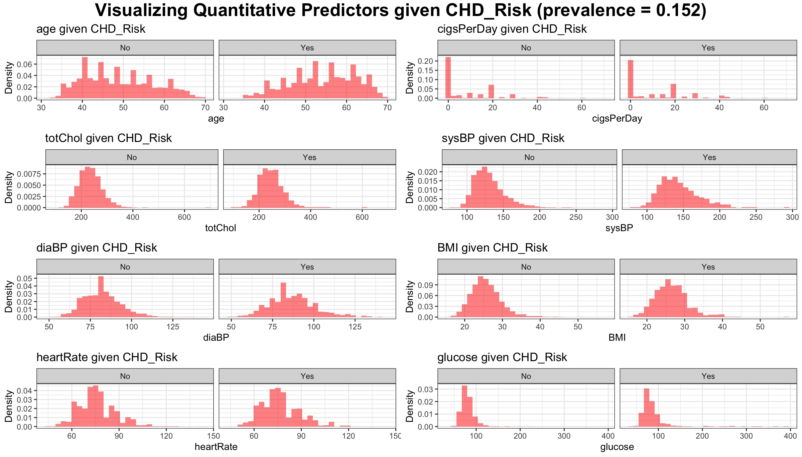

```{r setup, include=FALSE}
knitr::opts_chunk$set(echo = TRUE)
```

```{r libraries, results='hide'}
source("na-convert.R")
library(tidyverse)
library(ggpubr)
library(xtable)
```

## EDA 

Read in the data and make note of missing values

```{r}
data_raw = read.csv("data/chd_risk.csv")
summary(data_raw)
```

Count number  in on missingness: 

```{r}
# Generate the number of missing values for each predictor
apply(is.na(data_raw), 2, sum)
missing_preds = c("education", "cigsPerDay", "totChol", "BMI", 
                  "heartRate", "glucose", "OnBPMeds")
```

Visualize distribution of quantitative predictors conditional on the CHD outcome: 

```{r, eval = FALSE}
quant_preds = c("age", "cigsPerDay", "totChol", "sysBP", 
                  "diaBP", "BMI", "heartRate", "glucose")

make_cond_hist = function(varname) {
  p1 = ggplot(data_raw, aes_string(x=varname)) + 
    geom_histogram(aes(y = ..density..), 
                   fill = "red", alpha = 0.5) + 
    labs(title=paste(varname, "given CHD_Risk")) +
    xlab(varname) +
    ylab("Density") + 
    facet_grid(. ~ CHD_Risk) + 
    theme_bw()
  return(p1)
}

graphs = lapply(quant_preds, make_cond_hist)
figure1 = ggarrange(graphs[[1]], graphs[[2]], graphs[[3]], graphs[[4]], 
          graphs[[5]], graphs[[6]], graphs[[7]], graphs[[8]],
          ncol = 2, nrow = 4)
annotate_figure(figure1,
                top = text_grob("Visualizing Quantitative Predictors given CHD_Risk (prevalence = 0.152)", face = "bold", size = 14)
)
```



Visualizing the Qualitative predictors by showing their distributions conditional on the outcome: 

```{r}
# Address Categorical predictors
cat_preds = c("education", "sex", "smoker", "OnBPMeds", 
              "PrevStroke", "Hyp", "Diab")
get_cond_prob_table = function(TABLE, flag = 0) { 
  col1 = TABLE[,1] / sum(TABLE[,1])
  col2 = TABLE[,2] / sum(TABLE[,2])
  return(cbind(No=col1, Yes=col2))
}
tab_education = get_cond_prob_table(table(data_raw$education, data_raw$CHD_Risk))
tab_sex = get_cond_prob_table(table(data_raw$sex, data_raw$CHD_Risk))
tab_smoker = get_cond_prob_table(table(data_raw$smoker, data_raw$CHD_Risk))
tab_OnBPMeds = get_cond_prob_table(table(data_raw$OnBPMeds, data_raw$CHD_Risk))
tab_PrevStroke = get_cond_prob_table(table(data_raw$PrevStroke, data_raw$CHD_Risk))
tab_Hyp = get_cond_prob_table(table(data_raw$Hyp, data_raw$CHD_Risk))
tab_Diab = get_cond_prob_table(table(data_raw$Diab, data_raw$CHD_Risk))

tab_prob_Yes = rbind(tab_education, tab_sex, tab_smoker, 
                     tab_OnBPMeds, tab_PrevStroke, tab_Hyp,
                     tab_Diab)
round(tab_prob_Yes,3)
```

Check for collinearity with GVIF. 

```{r}
# Check for collinearity
library(car)
mod.vif.lm <- lm(as.numeric(CHD_Risk) ~ ., data=data_raw)
vif(mod.vif.lm)
```

Because all values in the last column are less than $3.1623 = \sqrt(10)$, there is not significant/strong evidence of multicollinearity.


